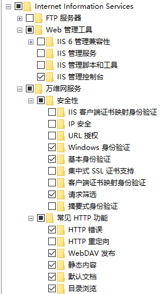

# windows 下启用webDAV

## windows 组件安装

控制面板-程序-程序和功能-启用或关闭 windows 功能

启用：

1. `Internet Information Service - Web管理工具` 下的 `IIS管理控制台`
2. `Internet Information Service - 万维网服务 - 安全性` 下的 `基本身份验证` 和 `Windows 身份验证`
3. `Internet Information Service - 万维网服务 - 常见 Http 功能` 下的 `WebDAV 发布` 和 `目录浏览`

## 配置 WebDAV 服务

打开 `IIS管理器`

1. 添加网站 - 填写网络名称 - 物理路径 - 端口号
2. WebDAV 创作规则 - 添加创作规则 - 允许所有用户 - 打开权限 - 启用 WebDAV
3. 身份验证 - 只启用基本身份验证
4. 目录浏览 - 启用目录浏览
5. 重新启动站点