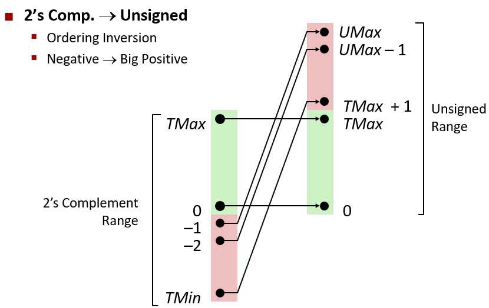

# 信息存储

## 虚拟内存：

1. 大多数计算机使用 8 位的块，或者字节(Byte)，作为最小的可寻址的内存单元，而不是访问内存中单独的位。机器级程序将内存视为一个非常大的字节数组，称为虚拟内存(virtual address space)。

2. 内存的每个字节都有一个唯一的地址，所有可能地址的集合就称为虚拟地址空间。

## 字数据大小
### unsigned 和 signed 之间的相互转换



**unsigned 和 signed 建议不要混用**

### 32位和64位系统中的字节大小差异

- 因为32位和64位系统，相同的数据类型会存在不同字节大小的差异。  
- 于是`ISO C99`标准中出现了头文件`stdint.h`引入了`intN_t`和`intN_t`，对不同的N值指定N位有符号和无符号整数。  
- 大多数编译器允许N为8、16、32和64  
- 声明为`uint16_t`，表示一个16位无符号变量；声明为`int32_t`，表示一个32位有符号变量  
- **使用确定大小的整数类型是程序员准确控制数据表示的最佳途径。**   

### 用宏打印`intN_t`和`intN_t`
- 确定宽度类型的带格式打印需要使用宏，以与系统相关的方式扩展为格式串。因此，举个例子来说，变量x和y的类型是 int32_t和uint64_t，可以通过调用printf来打印它们的值，如下所示:  
```C
printf("x=%"PRId32“，y = %"PRIu64"\n"，x，y);
```
- 编译为64位程序时，宏`PRId32`展开成字符串“d”，宏`PRIu64`则展开成两个字符串“1”“u”。当C预处理器遇到仅用空格(或其他空白字符)分隔的一个字符串常量序列时，就把它们串联起来。因此，上面的 printf 调用就变成了:  
```C
printf("x= %d,y= %lu\n"，x，y);  
```
**使用宏能保证:不论代码是如何被编译的，都能生成正确的格式字符串。**  

## 寻址和字节顺序
### 16进制浮点数的表示

相同的数字，用整数存储的和用浮点数存储的十六进制数不一样  
**整数中除了最高有效位1，其他都存在与浮点数中**  

## 算术右移（>>）与逻辑右移（>>>）

逻辑右移就是不考虑符号位，右移一位，左边补零即可。  
算术右移需要考虑符号位，右移一位，若符号位为1，就在左边补1,；否则，就补0。  

## 移位
<table id="align_table">
    <tr>
        <td colspan="2">x</td>
        <td colspan="2">x << 3</td>
        <td colspan="2">x >> 2(逻辑的)</td>
        <td colspan="2">x >> 2(算术的)</td>
    </tr>
    <tr>
        <td>十六进制</td>
        <td>二进制</td>
        <td>二进制</td>
        <td>十六进制</td>
        <td>二进制</td>
        <td>十六进制</td>
        <td>二进制</td>
        <td>十六进制</td>
    </tr>
    <tr>
        <td>0xC3</td>
        <td>11000011</td>
        <td>00011000</td>
        <td>0x18</td>
        <td>00110000</td>
        <td>0x30</td>
        <td>11110000</td>
        <td>0xF0</td>
    </tr>
    <tr>
        <td>0x75</td>
        <td>01110101</td>
        <td>10101000</td>
        <td>0xA8</td>
        <td>00011101</td>
        <td>0x1D</td>
        <td>00011101</td>
        <td>0x1D</td>
    </tr>
    <tr>
        <td>0x87</td>
        <td>10000111</td>
        <td>00111000</td>
        <td>0x38</td>
        <td>00100001</td>
        <td>0x21</td>
        <td>11100001</td>
        <td>0xE1</td>
    </tr>
    <tr>
        <td>0x66</td>
        <td>01100110</td>
        <td>00110000</td>
        <td>0x30</td>
        <td>00011001</td>
        <td>0x19</td>
        <td>00011001</td>
        <td>0x19</td>
    </tr>
</table>

# 整数表示

## show_bytes()

```c
#include <stdio.h>

typedef unsigned char *byte_pointer;

void show_bytes(byte_pointer start, size_t len) {
    size_t i;
    for (i = 0; i < len; i++) 
        printf(" %.2x", start[i]);
    printf("\n");
}

void show_int(int x) {
    show_bytes((byte_pointer) &x, sizeof(int));
}

void show_float(float x) {
    show_bytes((byte_pointer) &x, sizeof(float));
}

void show_pointer(void *x) {
    show_bytes((byte_pointer) &x, sizeof(void *));
}
```

## C语言中的有符号数和无符号数

当执行一个运算时，如果它的一个运算数是有符号的而另一个是无符号的，那么C语言会隐式地将有符号参数强制类型转换为无符号数，并假设这两个数都是非负的，来执行运算。  

### 升级规则

|            表达式            |  类型  | 求值  |
| :--------------------------: | :----: | :---: |
| -2147483647-1 == 2147483648U | 无符号 |   1   |
|  -2147483647-1 < 2147483647  | 有符号 |   1   |
| -2147483647-1U < 2147483647  | 无符号 |   0   |
| -2147483647-1 < -2147483647  | 有符号 |   1   |
| -2147483647-1U < -2147483647 | 无符号 |   0   |

## 扩展一个数字的位表示

### 从一个较小的数据类型转换到一个较大的数据类型是可以的

零扩展(zero extension)

```c
short sx = -12345;          /*-12345*/
unsigned short usx = sx;    /* 53191*/
int x = sx;                 /* -12345*/
unsigned ux = usx;          /* 53191*/
printf("sx = %d:\t", sx);
show_bytes((byte_pointer) &sx, sizeof(short));
printf("usx = %u:\t", usx);
show_bytes((byte_pointer) &usx, sizeof(unsigned short));
printf("x = %d:\t", x);
show_bytes((byte_pointer) &x, sizeof(int));
printf("ux = %u:\t", ux);
show_bytes((byte_pointer) &ux, sizeof(unsigned));
```
在采用补码表示的 32 位大端法机器上运行这段代码时，打印出如下输出：
```
sx  = -12345:   cf c7
usx = 53191:    cf c7
x   = -12345:   ff ff cf c7
ux  = 53191:    00 00 cf c7
```

### 从一个较大的数据类型转换到一个较小的数据类型是不可以的

```c
short sx = -12345;     /*-12345*/
unsigned uy = sx;

printf("uy = %u:\t", uy);
show_bytes((byte_pointer) &uy, sizeof(unsigned));
```
在一台大端法机器上运行这段代码时，打印出如下输出：
```
uy = 4294954951:    ff ff cf c7
```
这表明当把`short`转换为`unsigned`时，我们应该先改变大小，之后再完成从有符号到无符号的转换。也就是说`(unsigned)sx`等价于`(unsigned)(int)sx`，求值得到`4294954951`，而不等价于`(unsigned)(unsigned short)sx`，后者求值得到`53191`。

### C 函数
```C
int fun1(unsigned word) {
    return (int) ((word << 24) >> 24);
}

int fun2(unsigned word) {
    return ((int) word << 24) >> 24;
}
```

|    word    |   func1    |   func2    |
| :--------: | :--------: | :--------: |
| 0x00000076 | 0x00000076 | 0x00000076 |
| 0x87654321 | 0x00000021 | 0x00000021 |
| 0x000000C9 | 0x000000C9 | 0xFFFFFFC9 |
| 0xEDCBA987 | 0x00000087 | 0xFFFFFF87 |
- func1 没有改变word的值  
- func2 当word倒数第二个字节位置处的数字大于等于8时，会输出一个负数  

# 整数运算

## 加法

### 无符号加法

<table id="align_table">
    <tr>
        <td colspan="2">x</td>
        <td colspan="2">-x(u 4)</td>
    </tr>
    <tr>
        <td>十六进制</td>
        <td>十进制</td>
        <td>十进制</td>
        <td>十六进制</td>
    </tr>
    <tr>
        <td>0</td>
        <td>0</td>
        <td>0</td>
        <td>0</td>
    </tr>
    <tr>
        <td>5</td>
        <td>5</td>
        <td>11</td>
        <td>B</td>
    </tr>
    <tr>
        <td>8</td>
        <td>8</td>
        <td>8</td>
        <td>8</td>
    </tr>
    <tr>
        <td>D</td>
        <td>13</td>
        <td>3</td>
        <td>3</td>
    </tr>
    <tr>
        <td>F</td>
        <td>15</td>
        <td>1</td>
        <td>1</td>
    </tr>
</table>

*2.28*

#### 代码

```c
/* Determine whether arguments can be added without overflow */
int uAdd_ok(unsigned x, unsigned y) {
    unsigned sum = x + y;
    return sum >= x;
}
```

### 补码加法

|       x       |       y       |     x + y      |  x + y(t 5)   | 情况  |
| :-----------: | :-----------: | :------------: | :-----------: | :---: |
| [10100]\(-12) | [10001]\(-15) | [100101]\(-27) |  [00101]\(5)  |   1   |
| [11000]\(-8)  | [11000]\(-8)  | [110000]\(-16) | [10000]\(-16) |   2   |
| [10111]\(-9)  |  [01000]\(8)  | [111111]\(-1)  | [11111]\(-1)  |   2   |
|  [00010]\(2)  |  [00101]\(5)  |  [000111]\(7)  |  [00111]\(7)  |   3   |
| [01100]\(12)  |  [00100]\(4)  | [010000]\(16)  | [10000]\(-16) |   4   |

*2.29*

#### 代码

```c
/* Determine whether arguments can be added without overflow */
int tAdd_ok(int x, int y) {
    int sum = x + y;
    int neg_over = x < 0 && y < 0 && sum >= 0;
    int pos_over = x > 0 && y > 0 && sum < 0;
    return !neg_over && !pos_over;
}
```

## 补码的非

<table id="align_table"">
    <tr>
        <td colspan="2">x</td>
        <td colspan="2">-x(t 4)</td>
    </tr>
    <tr>
        <td>十六进制</td>
        <td>十进制</td>
        <td>十进制</td>
        <td>十六进制</td>
    </tr>
    <tr>
        <td>0</td>
        <td>0</td>
        <td>0</td>
        <td>0</td>
    </tr>
    <tr>
        <td>5</td>
        <td>5</td>
        <td>-5</td>
        <td>B</td>
    </tr>
    <tr>
        <td>8</td>
        <td>-8</td>
        <td>-8</td>
        <td>8</td>
    </tr>
    <tr>
        <td>D</td>
        <td>-3</td>
        <td>3</td>
        <td>3</td>
    </tr>
    <tr>
        <td>F</td>
        <td>-1</td>
        <td>1</td>
        <td>1</td>
    </tr>
</table>

*2.33*

## 乘法

### 二进制乘法运算

模仿手工算十进制乘法，一位位乘然后再加
```
     1001
*    1101
=============
     1001
    0000
   1001
+ 1001
=============
  1110101
```

### 规律

- 虽然完整的乘机的位级表示可能会不同，但是截断后成绩的位级表示是相同的。

|      模式       |            x             |            y             |               x·y               |        截断的x·y         |
| :-------------: | :----------------------: | :----------------------: | :-----------------------------: | :----------------------: |
| 无符号</br>补码 | \[100](4)</br>\[100](-4) | \[101](5)</br>\[101](-3) | \[010100](20)</br>\[001100](12) | \[100](4)</br>\[100](-4) |
| 无符号</br>补码 | \[010](2)</br>\[010](2)  | \[111](7)</br>\[111](-1) | \[001110](14)</br>\[111110](-2) | \[110](6)</br>\[110](-2) |
| 无符号</br>补码 | \[110](6)</br>\[110](-2) | \[110](6)</br>\[110](-2) | \[100100](36)</br>\[000100](4)  | \[100](4)</br>\[100](-4) |

### 代码

```c
int tMul_ok(int32_t x, int32_t y)
{
	int32_t p = x * y;

	/* Either x is zero, or dividing p by x gives y */
	return !x || p / x == y;
}

int tMul_ok2(int32_t x, int32_t y)
{
	int64_t p = (int64_t)x * y; /*一定要先将右边手动转成 int64_t */
	/*printf("p=%" PRId64 ", q=%" PRId32 "\n", p,q);*/

	return p == (int32_t)p;
}
```

### 乘以常数

用移位计算：
 - 形式A:`(x<<n)+(x<<(n-1))+...+(x<<m)`
 - 形式B:`(x<<(n+1))-(x<<m)`

练习：
|   K   | 移位  | 加法/减法 |         表达式         |
| :---: | :---: | :-------: | :--------------------: |
|   6   |   2   |     1     |   (x << 2) + (x<<1)    |
|  31   |   1   |     1     |      (x <<5 ) - x      |
|  -6   |   2   |     1     |  (x << 1) - (x << 3)   |
|  55   |   2   |     2     | (x << 6) - (x <<3) - x |

 - 第二行比较重要的一点是11111的第一个1的下标是4，最后一个1的下标是0，所以n=4,m=0,当确定了n,m之后就可以根据公式进行计算
 - 第一行6的二进制表示我为0110，所以n=2,m=1
     - 形式A：x * k = (x << 2) + (x<<1)
     - 形式B：x * k = x * (2^3^ - 2^1^) = (x<<3) - (x << 1)
 - 第二行31的二进制表示为11111，所以n=4,m=0
     - 形式A：x * k = (x<<4) + (x<<3) + (x<<2) + (x<<1) + x
     - 形式B：x * k = (x <<5 ) - x
 - 第三行-6的二进制表示为-110（补码表示），所以n = 2，m = 1
     - 形式A：x * k = -((x << 2) + (x<<1))=-(x << 2) - (x << 1)
     - 形式B：x * k = -( (x<<3) - (x << 1)) = (x << 1) - (x << 3)
 - 第四行55的二进制为110111，所以n=5,m=3
     - 形式A：x * k = (x * 1 * 2^5^) + (x * 1 * 2^4^) + (x * 1 * 2^2^) + (x * 1 * 2^1^) + (x * 1 * 2^0^) =  (x << 5) + (x << 4) + (x << 2) + (x << 1) + x
     - 形式B：x * k = (x * 2^6^) - (x * 2^3^) - (x * 2^0^) = (x << 6) - (x <<3) - x

## 除法

理想的除法状态为：
 - 对于 x >= 0 和 x > y，结果会是 x / y (向下取整)
 - 对于 x < 0 和 y > 0，结果会是 x / y (向上取整)
 - 也就是向零取整

### 代码

```c
// 计算x/16，要考虑偏置，不能使用除、模、乘运算、条件语句以及比较运算符
// 假设int是32位长
int book_div16(int x)
{
        /* Compute bias to be either 0 (x >= 0) or 15 (x < 0) */
        int bias = (x >> 31) & 0xF;//右移31位后，32位上面都是符号位的值
        //如果为非负数，符号位为0，bias变量为0
        //如果为负数，符号位为1，bias变量为0xF，即15
        return (x + bias) >> 4;
}
```

# 偏置技术(bias)

用偏置技术解决修正不合适的舍入：
 - 对于整数 x 和 y (y > 0) 有 `x / y (向上取整) == (x + y - 1) / y (向下取整)`
 - 于是有算术右移的补码机器表达式 `( x < 0 ? (x + y - 1) / y : x) >> k`

# 浮点数

## IEEE浮点表示

定位表示法不能非常有效地表示非常大的是数字，所以我们希望通过给定x和y的值表示形如`x * 2^y^`的数。  
IEEE浮点标准用`V=(-1)^s^ * M * 2^E^`的形式来表示一个数  
 - s：符号 决定这个数是正数还是负数；s直接编码符号s
 - E：阶码 偏置之后的阶码值 作用是对浮点数加权，权重是2的E次幂
   - k 位的阶码字段 `exp` 编码阶码
   - e：假定阶码字段是一个无符号整数所表示的值
   - 2^E^：阶码的权重
 - M：尾数 是一个二进制小数，范围为 `1~2-ε` 或者是 `0~1-ε`
   - n 位的小数字段 `frac` 编码尾数
   - f：小数值
 - M * 2^E^：该数(未归约的)小数值
 - V：该数规约后的小数值
 - float格式中，s、`exp` 和 `frac` 字段分别为1位，k=8位和n=23位，得到一个32位的表示
 - double格式中，s、`exp` 和 `frac` 字段分别为1位，k=11位和n=52位，得到一个64位的表示

### 偏置(bias)

- Bias是一个等于 `2^k-1^-1` (单精度是127，双精度是1023)的偏置值
- 对于单精度是 `-126~+127` 对于双精度是 `-1022~+1023`

### 规格化的值

- 当`exp`的位模式既不全为0(数值0)，也不全为1(单精度数值为255，双精度数值为2047)时，
- `E = e - Bias`
- `M = 1 + f`，小数字段 `frac` 被解释为描述小数值 f，`M >= 1` 永远成立

### 非格式化的值

- 当阶码域为全 0 时
- `E = 1 - Bias`
- `M = f`
- 提供了表示数值 0 的方法
- 表示非常接近于 0.0 的数

### 特殊值

- 当阶码域为全 1 时
- 无穷

#### 练习

|   位    |   e   |   E   | 2^E^  |   f   |   M   | 2^E^ * M |   V    | 十进制 |
| :-----: | :---: | :---: | :---: | :---: | :---: | :------: | :----: | :----: |
| 0 00 00 |   0   |   0   |   1   |   0   |   0   |    0     |   0    |   0    |
| 0 00 01 |   0   |   0   |   1   |  1/4  |  1/4  |   1/4    |  1/4   |  0.25  |
| 0 00 10 |   0   |   0   |   1   |  1/2  |  1/2  |   1/2    |  1/2   |  0.5   |
| 0 00 11 |   0   |   0   |   1   |  3/4  |  3/4  |   3/4    |  3/4   |  0.75  |
| 0 01 00 |   1   |   0   |   1   |   0   |   1   |    1     |   1    |   1    |
| 0 01 01 |   1   |   0   |   1   |  1/4  |  5/4  |   5/4    |  5/4   |  1.25  |
| 0 01 10 |   1   |   0   |   1   |  1/2  |  3/2  |   3/2    |  3/2   |  1.5   |
| 0 01 11 |   1   |   0   |   1   |  3/4  |  7/4  |   7/4    |  7/4   |  1.75  |
| 0 10 00 |   2   |   1   |   2   |   0   |   1   |    2     |   2    |   2    |
| 0 10 01 |   2   |   1   |   2   |  1/4  |  5/4  |   10/4   |  5/2   |  2.5   |
| 0 10 10 |   2   |   1   |   2   |  1/2  |  3/2  |   6/2    |   3    |   3    |
| 0 10 11 |   2   |   1   |   2   |  3/4  |  7/4  |   14/4   |  7/2   |  3.5   |
| 0 11 00 |   -   |   -   |   -   |   -   |   -   |    -     | 无穷大 |   -    |
| 0 11 01 |   -   |   -   |   -   |   -   |   -   |    -     |  NaN   |   -    |
| 0 11 10 |   -   |   -   |   -   |   -   |   -   |    -     |  NaN   |   -    |
| 0 11 11 |   -   |   -   |   -   |   -   |   -   |    -     |  NaN   |   -    |

### 整数值转换为浮点形式

1. 12345 具有二进制表示[11 0000 0011 1001]
2. 通过将二进制小数点左移 13 位，得到12345=1.1000000111001 * 2^13^
3. 为了用IEEE单精度来编码，我们丢弃开头的 1，并且在末尾增加 10 个 0 ，来构造小数字段，得到[100 0000 1110 0100 0000 0000]
4. 为了构造阶码字段，我们用 13 加上偏置量 127，得到140，其二进制表示为[1000 1100]。
5. 加上符号位 0，我们就得到二进制的浮点表示[0100 0110 0100 0000 1110 0100 0000 0000]

#### 练习

将整数 3 510 593 转换为单精度浮点形式：

1. 3 510 593 具有二进制表示[11 0101 1111 0001 0100 0001]
2. 通过将二进制小数点左移 21 位，得到 3 510 593 = 1.101011001000101000001 * 2^21^
3. 丢弃开头的 1. ，并且在末尾增加 2 个 0 ，来构造小数字段，得到[101 0110 0100 0101 0000 0100]
4. 为了构造阶码字段，我们用 21 加上偏置量 127，得到148，其二进制表示为[1001 0100]
5. 加上符号位 0，我们就得到二进制的浮点表示[0100 1010 0101 0110 0100 0101 0000 0100]

