# 名词

- ISA：Instruction Set Architecture(指令集架构)的缩写，也叫指令集体系结构。它定义了机器级程序的格式和行为，它定义了处理器状态、指令的格式，以及每条指令对状态的影响。
- PC：程序计数器，在x86-64中称为`%rip`，表示下一条要执行的指令在内存中的地址。
- scalar data types：标量数据类型，是计算机科学中的一个术语。标量是指一种基本的数据类型，它表示单个值，并且不可拆分为更小的部分。标量数据类型在程序设计中非常常见，包括整数、浮点数、字符和布尔型等。
- vector：向量，表示一种被用于向量数据计算或是多媒体处理等运算的指令集或硬件加速器。这些指令集和硬件加速器通常用于执行一些对于大规模数据和向量的加速运算，如矩阵乘法、卷积等。

# gcc

## 参数

### 优化等级

`-Og`：告诉编译器使用会生成符合原始C代码整体结构的机器代码的优化等级
- 使用较高的优化级别优化产生的代码会严重变形，以至于产生的机器代码和初始源代码之间的关系难以理解。
- 实际上，从得到的程序的性能考虑，较高级别的优化被认为是较好的选择
  - 例如，以选项 `-O1` 或 `-O2` 指定

### 汇编代码

C预处理器扩展源代码，插入所有用`#include`命令指定的文件，并扩展所有用`#define`声明指定的宏。

`-S`：能看到C语言编译器产生的汇编代码。
- 生成 `*.s` 汇编文件，但是不做其他进一步的工作。

### 目标代码

汇编器将 `*.s` 文件的汇编代码转换为二进制的目标代码文件。并生成目标代码文件 `*.o`。
- 包含所有指令的二进制表示，但还没填入全局的地址

`-c`：GCC会编译并汇编该代码，生成 `*.o` 文件 
- 它是二进制格式的，无法直接查看

### 可执行代码

`-o`：链接器将目标代码文件 `*.o` 与实现库函数的代码合并，并产生最终的可执行代码文件。
- 文件名由 `-o 文件名` 指定

### 反汇编器

`objdump -d 文件名`：根据机器代码产生一种类似于汇编代码的格式。针对`*.o`文件。

# 数据格式

| C declaration | Intel data type  | Assembly-code | suffix	Size (bytes) |
| :-----------: | :--------------: | :-----------: | :-----------------: |
|     char      |       Byte       |       b       |          1          |
|     short     |       Word       |       w       |          2          |
|      int      |   Double word    |       l       |          4          |
|     long      |    Quad word     |       q       |          8          |
|    char *     |    Quad word     |       q       |          8          |
|     float     | Single precision |       s       |          4          |
|    double     | Double precision |       l       |          8          |

# 访问信息

1. 最初的8086中有 8 个 16 位的寄存器，即下表中 %ax ~ %sp
2. IA32中寄存器扩展为32位，标号有 %eax ~ %esp
3. X86-64中寄存器扩展成64位，编号有 %rax ~ %rsp，还增加了 8 个寄存器

| 63 ~ 31 | 31 ~ 15 | 15 ~ 7 | 7 ~ 0 |     usage     |
| :-----: | :-----: | :----: | :---: | :-----------: |
|  %rax   |  %eax   |  %ax   |  %al  | return value  |
|  %rbx   |  %ebx   |  %bx   |  %bl  | Callee saved  |
|  %rcx   |  %ecx   |  %cx   |  %cl  | 4th argument  |
|  %rdx   |  %edx   |  %dx   |  %dl  | 3rd argument  |
|  %rsi   |  %esi   |  %si   | %sil  | 2nd argument  |
|  %rdi   |  %edi   |  %di   | %dil  | 1st argument  |
|  %rbp   |  %ebp   |  %bp   | %bpl  | Callee saved  |
|  %rsp   |  %esp   |  %sp   | %spl  | Stack pointer |
|   %r8   |  %r8d   |  %r8w  | %r8b  | 5th argument  |
|   %r9   |  %r9d   |  %r9w  | %r9b  | 6th argument  |
|  %r10   |  %r10d  | %r10w  | %r10b | Callee saved  |
|  %r11   |  %r11d  | %r11w  | %r11b | Callee saved  |
|  %r12   |  %r12d  | %r12w  | %r12b | Callee saved  |
|  %r13   |  %r13d  | %r13w  | %r13b | Callee saved  |
|  %r14   |  %r14d  | %r14w  | %r14b | Callee saved  |
|  %r15   |  %r15d  | %r15w  | %r15b | Callee saved  |

- 字节级操作可以访问最低的字节
- 16位操作可以访问最低的两个字节
- 32位操作可以访问最低的四个字节
- 64位操作可以访问整个寄存器

## 操作数指示符

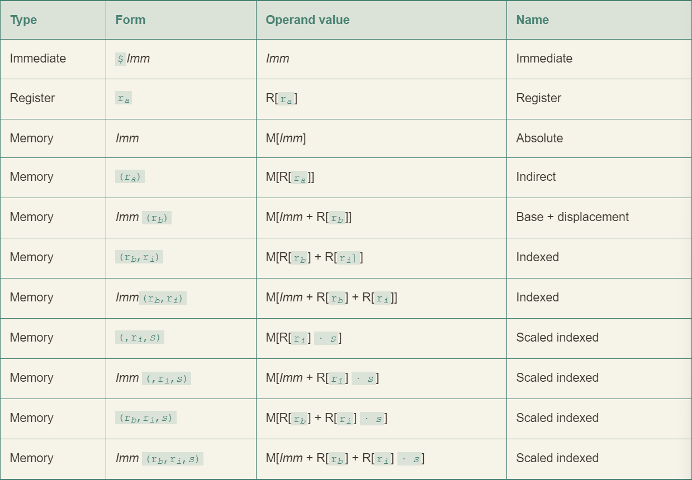

- 立即数(immediate): 在ATT格式的汇编代码中，立即数的书写方式是 `$` 后面跟一个用标准 C 表示法表示的整数，例如`$-577`、`$0x1F`。
- 寄存器(register): ra 表示任意寄存器a，用引用 R[ra] 来代表它的值
- 内存引用：根据地址访问内存位置。用符号 Mb[Addr] 表示对存储在内存中从地址 Addr 开始的 b 个字节值的引用。通常省略 b
- 最下面的表示是最常用的形式

## 数据传送指令

- S：源操作数（source operand）
- D：目标操作数（destination operand）
- I：立即数操作数（immediate operand）
- R：寄存器操作数（register operand）

### 简单的数据传送指令

- 根据源操作数选择指令
- 使用到操作数格式寻址时，必须为64位寄存器
- 两个操作数不能都为内存地址，进行mov其中一个必须为寄存器
- 不能以立即数作为目标操作数

|   Instruction   | Effect |       Description       |
| :-------------: | :----: | :---------------------: |
| mov	       S, D | D ← S  |          Move           |
|      movb       |        |        Move byte        |
|      movw       |        |        Move word        |
|      movl       |        |    Move double word     |
|      movq       |        |     Move quad word      |
| movabsq	   I, R | R ← I  | Move absolute quad word |

- movl 指令以寄存器作为目标时，会把该寄存器的高位4字节设置为0
  - x86-64采用的惯例，即任何为寄存器生成32位值的指令都会将该寄存器的高位部分设置为0

### 零扩展数据传送指令

| Instruction |      Effect       |              Description               |
| :---------: | :---------------: | :------------------------------------: |
|  movz S,R   | R ← ZeroExtend(S) |        Move with zero extension        |
|   movzbw    |                   |    Move zero-extended byte to word     |
|   movzbl    |                   | Move zero-extended byte to double word |
|   movzwl    |                   | Move zero-extended word to double word |
|   movzbq    |                   |  Move zero-extended byte to quad word  |
|   movzwq    |                   |  Move zero-extended word to quad word  |

- 以寄存器或内存为源，以寄存器作为目的
- MOVZ 类指令把目的中的剩余的字节填充为0

### 符号扩展数据传送指令

| Instruction |         Effect          |                 Description                 |
| :---------: | :---------------------: | :-----------------------------------------: |
|  movs S,R   |    R ← SignExtend(S)    |          Move with sign extension           |
|   movsbw    |                         |       Move sign-extended byte to word       |
|   movsbl    |                         |   Move sign-extended byte to double word    |
|   movswl    |                         |   Move sign-extended word to double word    |
|   movsbq    |                         |    Move sign-extended byte to quad word     |
|   movswq    |                         |    Move sign-extended word to quad word     |
|   movslq    |                         | Move sign-extended double word to quad word |
|    cltq     | %rax ← SignExtend(%eax) |          Sign-extend %eax to %rax           |

- 以寄存器或内存为源，以寄存器作为目的
- cltq 指令它没有操作数，总是以 %eax 为源，以 %rax 为符号扩展结果的目的。它的效果和 `movslq %eax, %rax` 完全一致
- MOVZ 类指令通过符号扩展来填充，把源操作的最高位进行复制

## 压入和弹出栈数据

| Instruction |                  Effect                  |  Description   |
| :---------: | :--------------------------------------: | :------------: |
|   pushq S   | R[%rsp] ← R[%rsp] –8;<br>M[R[%rsp]] ← S  | Push quad word |
|   popq D    | D ← M[R[%rsp]];<br>R[%rsp] ← R[%rsp] + 8 | Pop quad word  |

pushq 等价
```
subq $8,%rsp
movq %rbp,(%rsp)
```
popq 等价
```
movq (%rsp),%rax
addq $8,$rsp
```

- 虽然等价，但是 pushq 和 popq 的指令编码仅为一个字节，而上面两条指令一共需要八个字节
- 栈和程序代码以及其它形式的程序数据都放在同一内存中，所以程序可以用标准的内存寻址方法访问栈内任何位置

# 算数和逻辑操作

| Instruction |     Effect     |       Description        |
| :---------: | :------------: | :----------------------: |
|  leaq S, D  |     D ← &S     |  Load effective address  |
|    inc D    |   D ← D + 1    |        Increment         |
|    dec D    |   D ← D - 1    |        Decrement         |
|    neg D    |     D ← -D     |          Negate          |
|    not D    |     D ← ~D     |        Complement        |
|  add S, D   |   D ← D + S    |           Add            |
|  sub S, D   |   D ← D - S    |         Subtract         |
|  imul S, D  |   D ← D * S    |         Multiply         |
|  xor S, D   |   D ← D ^ S    |       Exclusive-or       |
|   or S, D   | D ← D &#124; S |            Or            |
|  and S, D   |   D ← D & S    |           And            |
|  sal k, D   |   D ← D << k   |        Left shift        |
|  shl k, D   |   D ← D << k   | Left shift (same as sal) |
|  sar k, D   |  D ← D >>A k   |  Arithmetic right shift  |
|  shr k, D   |  D ← D >>L k   |   Logical right shift    |

- 加载有效地址(leaq)指令通常用来执行简单的算术操作
- ATT格式的汇编代码中操作数的顺序与一般的直觉相反

## 加载有效地址(leaq)

- 实际上是movq指令的变形，指令形式是从内存读数据到寄存器，但实际上根本没有引用内存
- 该指令并不是从指定的位置读入数据，而是将有效地址写入到目的操作数
- 它可以简洁的描述普通的算术操作
  - 如果寄存器 %rdx 的值为 x，那么指令 `leaq 7(%rdx, %rdx, 4)`，%rax 将设置寄存器 %rax 的值为 `5x + 7`
- 目的数必须为一个寄存器

例如：  

c程序
```c
long scale(long x, long y, long z) {
    long t = x + 4 * y + 12 * z;
    return t;
}
```
编译时，算术运算将以三条 leaq 指令实现：
```
  // long scale(long x, long y, long z)
  // x in %rdi, y in %rsi, z in %rdx
scale:
  leaq	(%rdi,%rsi,4), %rax		// x + 4*y
  leaq	(%rdx,%rdx,2), %rdx		// z + 2*z = 3*z
  leaq	(%rax,%rdx,4), %rax		// (x+4*y) + 4*(3*z) = x + 4*y + 12*z
  ret
```

- 它能执行加法和有限形式的乘法

## 二元操作

- 源操作数是第一个，目的操作数是第二个
  - `subq %rax,%rdx` 可以解读为：从%rdx中减去%rax
- 第一个操作数可以是立即数、寄存器或是内存位置
- 第二个操作数可以是寄存器或是内存地址。
  - 当第二个数位内存地址时，处理器必须从内存读出值，执行操作，再把结果写回内存

## 移位操作 SA

`SAL 移位量, 移位的数`

- 移位量可以是一个立即数，或者放在单字节寄存器 %cl 中(能且只能放在这个特定寄存器)
- 当寄存器 %cl 的十六进制值为 0xFF 时，salb 会移 7 位，salw 会移 15 位，sall 会移 31 位，salq 会移 63 位
- 左移指令有两个名字：SAL 和 SHL
  - 两者效果一致，都是将右边填上0
- 右移指令不同
  - SAR执行算术移位(填上符号位)
  - SHR执行逻辑以为(填上0)

## xorq %rdx,%rdx

- 这个指令用来将寄存器设置为0
- 最直接的方法是 movq $0,%rdx
- xorq版本只需要三个字节，movq版本则需要七个字节

## 特殊的算术操作

- x86-64 指令集对 128 位(16 字节)数的操作提供有限的支持。
- 延续字(2字节)、双字(4字节)和四字(8字节)的命名惯例，Intel 把16字节的数称为八字(oct word)。

| Instruction |                              Effect                               |      Description       |
| :---------: | :---------------------------------------------------------------: | :--------------------: |
|   imulq S   |                   R[%rdx]:R[%rax] ← S × R[%rax]                   |  Signed full multiply  |
|   mulq S    |                   R[%rdx]:R[%rax] ← S × R[%rax]                   | Unsigned full multiply |
|    cqto     |               R[%rdx]:R[%rax] ← SignExtend(R[%rax])               |  Convert to oct word   |
|   idivq S   | R[%rdx] ← R[%rdx]:R[%rax] mod S;<br>R[%rax] ← R[%rdx]:R[%rax] ÷ S |     Signed divide      |
|   divq S    | R[%rdx] ← R[%rdx]:R[%rax] mod S;<br>R[%rax] ← R[%rdx]:R[%rax] ÷ S |    Unsigned divide     |

# 控制

## 条件码

- cf: 进位标志：最近的操作使最高位产生了进位。可用来检查无符号操作的溢出。
  - (unsigned) t < (unsigned) a
  - Unsigned overflow
- zf: 零标志：最近的操作得出的结果为 0，如果两个操作数相等，零标志设置为 1
  - (t == 0)
  - Zero
- sf: 符号标志：最近的操作得到的结果为负数
  - (t < 0)
  - Negative
- of: 溢出标志：最近的操作导致一个补码溢出--正溢出或负溢出
  - (a < 0 == b < 0) && (t < 0 ! = a < 0)
  - Signed overflow

## 访问条件码

条件码通常不会直接读取，常见使用方式：

1. 可以根据条件码的某种组合，将一个字节设置为 0 或 1
2. 可以条件跳转到程序的某个其他的部分
3. 可以有条件地传送数据

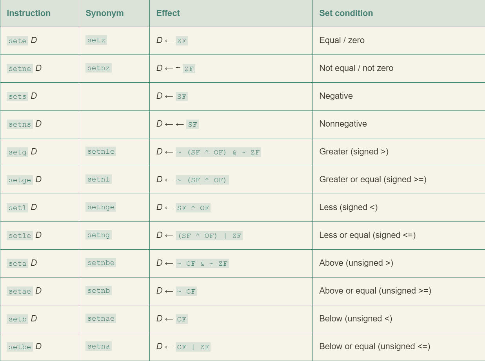

## 跳转指令

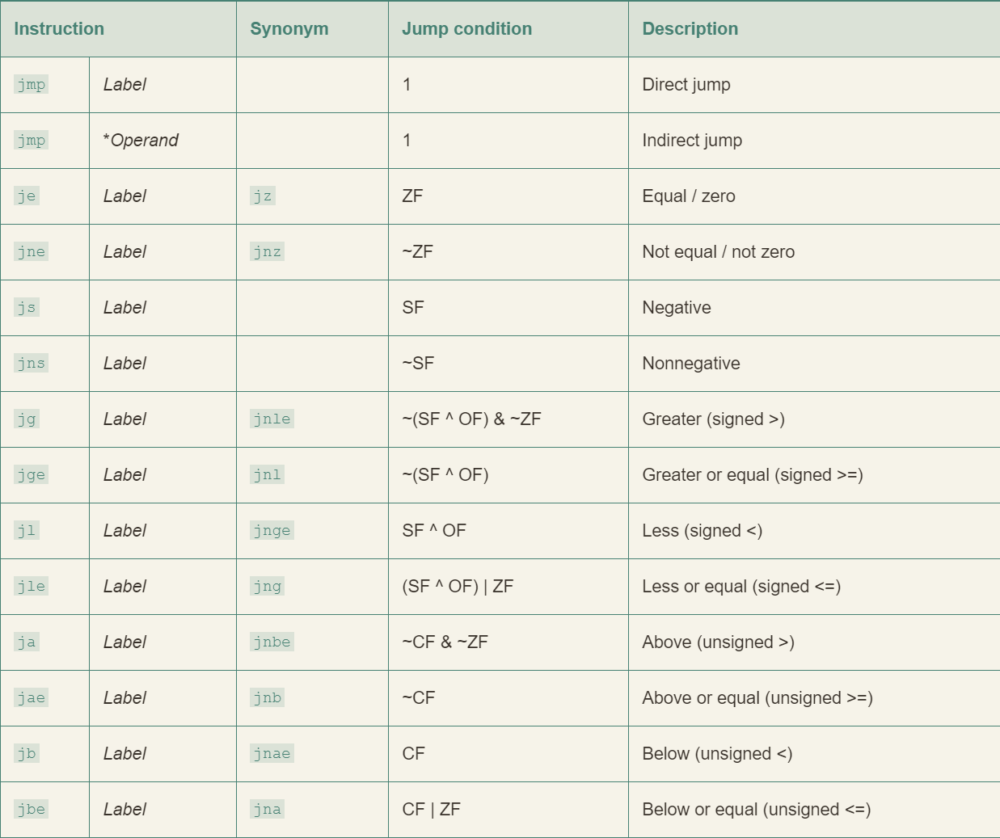

```
  movq	%rdi, %rax
  jmp	.L2
.L3:
  sarq	%rax
.L2:
  testq	%rax, %rax
  jg	.L3
  rep; ret
```

汇编器产生的“. o”格式的反汇编版本如下：

```
0:	48 89 f8	mov	%rdi,%rax
3:	eb 03		jmp	8 <loop+0x8>
5:	48 d1 f8	sar	%rax
8:	48 85 c0	test	%rax,%rax
b:	7f f8		jg	5 <loop+0x5>
d:	f3 c3		repz retq
```

链接后的程序反汇编版本：

```
4004d0: 48 89 f8	mov %rdi,%rax
4004d3: eb 03		jmp 4004d8 <loop+0x8>
4004d5: 48 d1 f8	sar %rax
4004d8: 48 85 c0	test %rax,%rax
4004db: 7f f8		jg 4004d5 <loop+0x5>
4004dd: f3 c3		repz retq
```

## 条件控制实现条件分支

goto 风格代码与汇编代码实现条件控制时非常相似

c 语言中 if-else 语句的通用形式：

```c
if (test-expr)
	then-statement
else
	else-statement
```

Goto 风格代码块：

```c
	t = text-expr;
	if (!t)
		goto false;
	then-statement
	goto done;
false:
	else-statement
done:
```

其中的 goto 在汇编中为 jmp 指令

### 练习

```c
long test(long x, long y, long z) {
  long val = x + y + z;
  if (x < -3) {
  	if (y < z)
  		val = x * y;
  	else
  		val = y * z;
  } else if (x > 2)
	  	val = x * z;
  return val;
}
```

gcc 产生如下汇编代码

```
  long test(long x, long y, long z)
  x in %rdi, y in %rsi, z in %rdx
  
  test:
  leaq	(%rdi,%rsi), %rax
  addq	%rdx, %rax
  cmpq	$-3, %rdi
  jge	.L2
  cmpq	%rdx, %rsi
  jge	.L3
  movq	%rdi, %rax
  imulq	%rsi, %rax
  ret
  .L3:
  movq	%rsi, %rax
  imulq	%rdx, %rax
  ret
  .L2:
  cmpq	$2, %rdi
  jle	.L4
  movq	%rdi, %rax
  imulq	%rdx, %rax
  .L4:
  rep; ret
```

## 条件传送实现条件分支

条件操作的传统方式简单而通用，但在现代处理器上可能会非常低效。

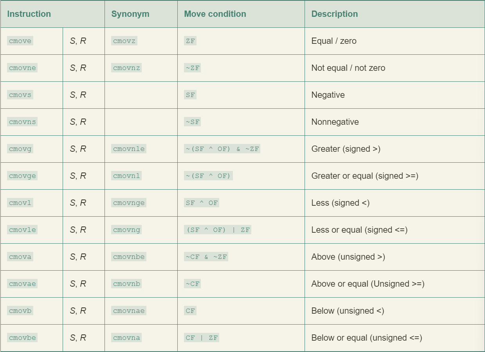

条件传送指令。当传送条件满足时，指令把源值 S 复制到目的 R

同条件跳转不同，处理器无需预测测试的结果就可以执行条件传送。**但不是所有情况下都可以使用条件传送。**

```c
v = test-expr ? then-expr : else-expr
```

用条件控制转移的标准方法编译：

```c
  if (!test-expr)
  	goto false;
  v = then-expr;
  goto done;
false:
  v = else-expr;
done:
```

基于条件传送代码会对两数都求值，可以用下面的抽象代码描述：

```c
v = then-expr;
ve = else-expr;
t = test-expr;
if (!t) v = ve;
```

- GCC 只有在两个表达式都很容易计算时，例如表达式分别都是一条加法指令，它才会使用条件传送。
- 即使许多分支预测错误的开销会超过更复杂的计算，GCC 还是会使用条件控制转移。
- 条件数据传送提供了一种用条件控制转移来实现条件操作的替代策略。它们只能用于非常受限制的情况。

## 循环

### while 循环

C

```c
long fact_while(long n)
{
	long result = 1;
	while (n > 1) {
		result *= n;
		n = n-1;
	}
	return result;
}
```

Goto version

```c
long fact_while_jm_goto(long n)
{
	long result = 1;
	goto test;
loop:
	result *= n;
	n = n-1;
test:
	if (n > 1)
	goto loop;
	return result;
}
```

assembly-language code

```
long fact_while(long n)
n in %rdi

fact_while:
  movl	$1, %eax	         Set result = 1
  jmp	.L5		             Goto test
.L6:		             loop:
  imulq	%rdi, %rax	         Compute result *= n
  subq	$1, %rdi	         Decrement n
.L5:		             test:
  cmpq	$1, %rdi	         Compare n:1
  jg	.L6		             If >, goto loop
  rep; ret		             Return
```

### Guarded-do 翻译方法

- 首先使用条件分支
- 如果初始条件不成立就跳过循环，把代码变换为 do-while 循环。
- 当使用较高优化等级时，例如使用命令行选项 `-O1` 时，GCC 会采用这种策略。

```c
t = test-expr;
if (!t)
	goto done;
do
	body-statement
	while (test-expr);
done:
```

Goto version

```c
t = test-expr;
if (!t)
	goto done;
loop:
	body-statement
	t = test-expr;
	if (t)
	goto loop;
done:
```

# 过程

## 运行时栈


- 通用的栈帧结构
- 栈用来传递参数、存储返回信息、保持寄存器，以及局部存储
- 为了提高空间和时间效率，`x86-64` 过程只分配自己所需要的栈帧部分
- 许多过程有 6 个或者更少的参数，那么所有的参数都可以通过寄存器传递
- 实际上，许多函数甚至根本不需要栈帧
- 当所有的局部变量都可以保存在寄存器中，而且该函数不会调用任何其他函数时，就可以这样处理。

### 练习

汇编代码：

```assembly
	Disassembly of leaf(long y)
	y in %rdi
1	0000000000400540 <leaf>:
2	400540:	48 8d 47 02	lea	0x2(%rdi),%rax	L1: z+2
3	400544:	c3		retq			L2: Return

4	0000000000400545 <top>:
	Disassembly of top(long x)
	x in %rdi
5	400545:	48 83 ef 05	 sub	$0x5,%rdi	T1: x-5
6	400549: e8 f2 ff ff ff	callq   400540 <leaf>	T2: Call leaf(x-5)
7	40054e: 4801c0		add	%rax,%rax	T3: Double result
8	400551:c3		retq			T4: Return
	...
	Call to top from function main
9	40055b: e8 e5 ff ff ff	callq	400545 <top>	M1: Call top(100)
10	400560: 4889c2		mov	%rax,%rdx	M2: Resume
```

代码执行过程表：

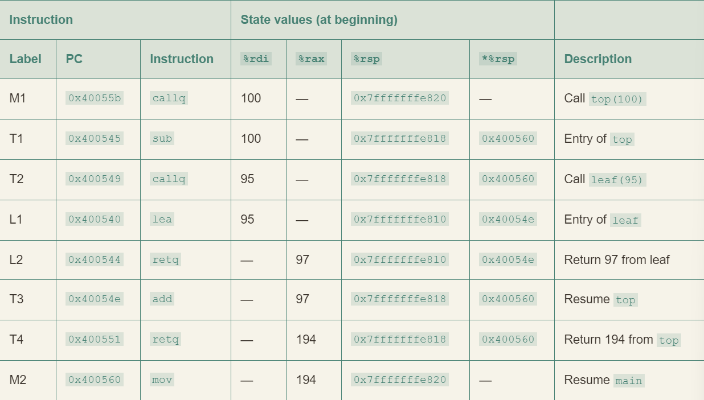

## 数据传送

函数传参少于等于六个时的寄存器：


- 大于六个的部分使用栈传递
- 7~n 放到栈上，而参数 7 位于栈顶

### 例如

C code

```c
void proc(long a1, long *a1p,
	  int a2, int *a2p,
	  short a3, short *a3p,
	  char a4, char *a4p)
{
	*a1p += a1;
	*a2p += a2;
	*a3p += a3;
	*a4p += a4;
}
```

Assembly code

```Assembly
	void proc(a1, a1p, a2, a2p, a3, a3p, a4, a4p)
	Arguments passed as follows:
	  a1 in %rdi (64 bits)
	  a1p in %rsi (64 bits)
	  a2 in %edx (32 bits)
	  a2p in %rcx (64 bits)
	  a3 in %r8w (16 bits)
	  a3p in %r9 (64 bits)
	  a4 at %rsp+8 ( 8 bits)
	  a4p at %rsp+16 (64 bits)
1	proc:
2	movq	16(%rsp), %rax	Fetch a4p (64 bits)
3	addq	%rdi, (%rsi)	*a1p += a1 (64 bits)
4	addl	%edx, (%rcx)	*a2p += a2 (32 bits)
5	addw	%r8w, (%r9)	*a3p += a3 (16 bits)
6	movl	8(%rsp), %edx	Fetch a4 (8 bits)
7	addb	%dl, (%rax)	*a4p += a4 (8 bits)
8	ret			Return
```

超出六个部分的栈帧结构：


## 寄存器中的局部存储空间

x86-64采用统一的寄存器使用管理：
- 寄存器 %rbx、%rbp 和 %r12 ~ %r15 被划分为**被调用者保存寄存器**
- P 调用过程 Q 时，Q 必须保存这些寄存器的值，保证他们的值在 Q 返回到 P 时与 Q 被调用时是一样的
- Q 为了保存一个寄存器的值不变
	- 要么不改变它
	- 要么把原始的值压入栈中，改变寄存器的值，在返回前从栈中弹出旧值
	- 压入寄存器的值会在栈帧中创建标号为“被保存的寄存器”的一部分
- 所有其他的寄存器，除了栈指针 %rsp ，都分类为**调用者保存寄存器**
	- 这意味着任何函数都能修改他们
	- 调用之前首先保存好这个数据是调用者 (P) 的责任

# 数组分配和访问

## 嵌套的数组

`int A[5][3]` 等价于 `typedef int row3_t[3]; row3_t A[5];`

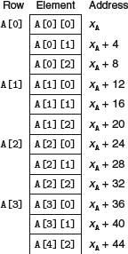

将数组 `A[i][j]` 复制到寄存器 %eax 中：

```assembly
	A in %rdi, i in %rsi, and j in %rdx
1	leaq	(%rsi,%rsi,2), %rax		Compute 3i
2	leaq	(%rdi,%rax,4), %rax		Compute xA + 12i
3	movl	(%rax,%rdx,4), %eax		Read from M[xA + 12i + 4]
```

### 练习

C code

```c
/* Set all diagonal elements to val */
void fix_set_diag(fix_matrix A, int val) {
	long i;
	for (i = 0; i < N; i++)
	  A[i][i] = val;
}
```

Optimization assembly code

```
fix_set_diag:
void fix_set_diag(fix_matrix A, int val)
A in %rdi, val in %rsi

	movl	$0, %eax
.L13:
	movl	%esi, (%rdi,%rax)
	addq	$68, %rax
	cmpq	$1088, %rax
	jne	.L13
	rep; ret
```

Optimization c code

```c
/* Set all diagonal elements to val */
void fix_set_diag_opt(fix_matrix A, int val) {
	int *Abase = &A[0][0];
	long i = 0;
	long iend = N * (N + 1);

	do {
		Abase[i] = val;
		i += (N + 1);
	} while (i != iend);
}
```

达到下一个对角线元素的地址恰好为 `i += (N + 1)`

## 变长数组

- 在一个循环中引用变长数组时，编译器常常可以利用访问模式的规律性来优化索引的计算。
- 如果允许使用优化，GCC 能够识别出程序访问多维数组的元素的步长。
- 生成的代码会避免直接应用规律等式会导致的乘法。
- 无论生成基于指针的代码还是基于数组的代码，这些优化都能显著提高程序的性能。

# 异质的数据结构

## 结构 struct

```c
struct rec {
	int i;
	int j;
	int a[2];
	int *p;
};
```

对应在内存中为：

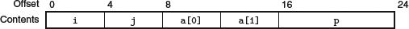

## 联合 union

```c
struct S3 {
	char c;
	int i[2];
	double v;
};
union U3 {
	char c;
	int i[2];
	double v;
};
```

对应在内存中为：


- 一个 union 的总的大小等于它最大字段的大小
- 它会绕过 C 语言类型系统提供的安全措施
- 已知一个数据结构中两个不同字段的使用是互斥的，若将这两个字段声明为 union 的一部分，而不作为 struct 的一部分，会减少分配空间的总量

### 例一

二叉树数据结构：

```c
struct node_s {
	struct node_s *left;
	struct node_s *right;
	double data[2];
};
```

- 一个节点需要 32 个字节

改为 union：

```c
union node_u {
	struct {
	  union node_u *left;
	  union node_u *right;
	} internal;
	double data[2];
};
```

- 一个节点只需要 16 个字节
- 但这样编码没法确定一个给定的节点是叶子节点还是内部节点
	- 可以通过引入一个枚举类型，定义这个 union 中可能的不同选择，然后再创建一个结构

```c
typedef enum { N_LEAF, N_INTERNAL } nodetype_t;

struct node_t {
	nodetype_t type;
	union {
	  struct {
	  	struct node_t *left;
	  	struct node_t *right;
	  } internal;
	  double data[2];
	} info;
};
```

- 这个结构总共需要 24 个字节
	- type 是 4 个字节
	- `info.internal.left` 和 `info.internal.right` 各要 8 个字节
	- `info.data` 要 16 个字节
	- 在字段 type 和 union 的元素之间需要 4 个字节的填充
- 过于麻烦带来的收益较小，但是对于较多字段的数据结构还是很吸引人的

## 数据对齐

- 许多系统对基本数据类型的合法地址作出限制，要求某种类型对象的地址必须是某个值 K(通常是 2、4 或 8)的倍数
- 目的是提高内存系统的性能
	- 假设一个处理器总是从内存中取 8 个字节，则地址必须是 8 的倍数
	- 如果我们能保证将所有的 double 类型数据的地址都对齐成 8 的倍数，那么就可以只用一个内存操作来读或写值了
	- 否则可能需要执行两次内存访问，因为对象被分放在两个 8 字节内存块中
- 汇编命令 `.align 8` 代表后面每个元素都会遵守 8 字节对齐的限制

例如考虑下列 struct 声明：

```c
struct S1 {
	int i;
	char c;
	int j;
};
```

假设用最小的 9 字节分配：

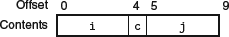

对齐之后：

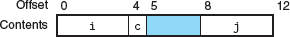

向后补齐的例子：


# 在机器级程序中将控制与数据结合起来

## 内存越界引用和缓冲区溢出

库函数 `gets` 的一个实现：

```c
/* Implementation of library function gets() */
char *gets(char *s)
{
	int c;
	char *dest = s;
	while ((c = getchar()) != `n' && c != EOF)
		*dest++ = c;
	if (c == EOF && dest == s)
		/* No characters read */
		return NULL;
	*dest++ = `0'; /* Terminate string */
	return s;
}
/* Read input line and write it back */
void echo()
{
	char buf[8]; /* Way too small! */
	gets(buf);
	puts(buf);
}
```

汇编代码：

```assembly
void echo()
echo:
subq	$24, %rsp	Allocate 24 bytes on stack
movq	%rsp, %rdi	Compute buf as %rsp
call	gets		Call gets
movq	%rsp, %rdi	Compute buf as %rsp
call	puts		Call puts
addq	$24, %rsp	Deallocate stack space
ret			Return
```

echo 函数的栈组织：

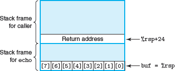

存在以下问题：

| Characters typed | Additional corrupted state |
| :--------------: | :------------------------: |
|       0–7        |            None            |
|       9–23       |     Unused stack space     |
|      24–31       |       Return address       |
|       32+        |   Saved state in caller    |

## 对抗缓冲区溢出攻击

### 栈随机化

- 使得栈的位置在程序每次运行时都有变化，即使不同的机器运行相同的代码，栈地址都是不同的
- 在 linux 系统中，有一个技术：`地址空间布局随机化`，简称 ASLR
	- 每次运行时程序的不同部分，包括程序代码、库代码、栈、全局变量和堆数据，都会被加载到内存的不同区域
- 空操作雪橇 (nop sled)
	- 执着的攻击者用蛮力克服随机化，反复的用不同的地址进行攻击
	- 在实际攻击代码之前插入很长一段 nop 指令，不停的对程序计数器加一，直到找到序列中的某个地址，程序就会经过这个序列到达攻击代码。
	- 但是在 64 位系统的出现，进行攻击需要尝试枚举更多更长的地址，大大降低了病毒或者蠕虫的传播速度

### 栈破坏检测

- 金丝雀
	- 在栈帧中的任何局部缓冲区与栈状态之间存储一个特殊的值
	- 在程序每次运行时随机产生

### 限制可执行代码区域

# 浮点代码

## 媒体 (media) 指令

- 这些指令的本意是允许多个操作以并行模式执行，称为单指令多数据或 SIMD
	- 这种模式中，对多个不同的数据并行执行同一个操作
- 最早出现的是 MMX ，然后从 MMX 到 SSE (streaming SIMD extensions 流式 SIMD 扩展)，以及最新的 AVX (advanced vector extensions 高级向量扩展)
- 每个扩展都是管理寄存器组中的数据
	- MMX 中称为 “MM” 寄存器 (64 位)
	- SSE 中称为 "XMM" 寄存器 (128 位)
	- AVX 中称为 "YMM" 寄存器 (256 位)
	- 所以每个 YMM 寄存器可以存放 8 个 32 位值，或 4 个 64 位值，这些值可以是整数或者浮点数
- 当对标量数据操作时，这些寄存器只保存浮点数，而且只使用低 32 位 (对于 float) 或 64 位 (对于 double) 


## 浮点传送和转换操作

- 引用内存的指令是标量指令，意味着它们只对单个而不是一组封装好的数据值进行操作
- 建议 32 位内存数据满足 4 字节对齐，64 位满足 8 字节对齐


- 浮点传送指令。X: XMM 寄存器，M32: 32-bit memory range; M64: 64-bit memory range
- 对于在两个 XMM 寄存器之间传送数据，GCC 会使用上图倒数两种指令之一
	- 这种情况，程序复制整个寄存器还是只复制低位值既不会影响程序功能也不会影响执行速度
	- 所以使用这些指令还是针对标量数据的指令没有实质上的差别
- 字母 a 表示 “aligned (对齐的)”
- 当用于读写内存时，如果地址不满足 16 字节对齐，它们会导致异常
- 但在两个寄存器之间传送数据，绝对不会出现错误对齐的情况


- 这些操作将浮点数转换成整数


- 第一个源的数据类型转换成目的的数据类型，它读自内存或一个通用的目的寄存器
- 第二个源值只会影响结果的高位字节，可以忽略
- 目标必须是 XMM 寄存器
- 最常见的使用场景中，第二个源和目的操作数都是一样的
	- 例如：`vcvtsi2sdq	%rax, %xmm1, %xmm1`
	- 它从 %rax 中读出一个长整数，转换为数据类型 double，最后把结果放进 XMM 寄存器 %xmm1 的低字节中

`vunpcklps` 指令通常用来交叉放置来自两个 XMM 寄存器的值，把他们存储到第三个寄存器中。若一个源寄存器的内容为字 `[s3, s2, s1, s0]` ，另一个源寄存器的内容 `[d3, d2, d1, d0]`，那么目的寄存器的值会是 `[s1, d1, s0, d0]` 。

### 例子

c code

```c
double fcvt(int i, float *fp, double *dp, long *lp)
{
	float f = *fp; double d = *dp; long l = *lp;
	*lp = (long) d;
	*fp = (float) i;
	*dp = (double) l;
	return (double) f;
}
```

x86-64 assembly code

```assembly
double fcvt(int i, float *fp, double *dp, long *lp)
	i in %edi, fp in %rsi, dp in %rdx, lp in %rcx
fcvt:
 vmovss	(%rsi), %xmm0			Get f = *fp
 movq	(%rcx), %rax			Get l = *lp
 vcvttsd2siq	(%rdx), %r8		Get d = *dp and convert to long
 movq	%r8, (%rcx)			Store at lp
 vcvtsi2ss	%edi, %xmm1, %xmm1	Convert i to float
 vmovss	%xmm1, (%rsi)			Store at fp
 vcvtsi2sdq	%rax, %xmm1, %xmm1	Convert l to double
 vmovsd	%xmm1, (%rdx)			Store at dp
The following two instructions convert f to double
 vunpcklps	%xmm0, %xmm0, %xmm0
 vcvtps2pd	%xmm0, %xmm0
 ret					Return f
```

## 浮点数操作


- S1 可以是一个 XMM 寄存器或一个内存位置
- S2 和 D 必须都是 XMM 寄存器

### 例子

assembly code

```
double funct2(double w, int x, float y, long z)
w in %xmm0, x in %edi, y in %xmm1, z in %rsi

funct2:
  vcvtsi2ss	%edi, %xmm2, %xmm2
  vmulss	%xmm1, %xmm2, %xmm1
  vunpcklps	%xmm1, %xmm1, %xmm1
  vcvtps2pd	%xmm1, %xmm2
  vcvtsi2sdq	%rsi, %xmm1, %xmm1
  vdivsd	%xmm1, %xmm0, %xmm0
  vsubsd	%xmm0, %xmm2, %xmm0
  ret
```

转换以上汇编代码为 c 语言版本：`y * x - w / z`

## 定义和使用浮点常数

- 和整数运算操作不同，AVX 浮点操作不能以立即数值作为操作数
- 编译器必须为所有的常量值分配和初始化存储空间，然后代码再把这些值从内存读入

### 例子

c code

```c
double cel2fahr(double temp)
{
	return 1.8 * temp + 32.0;
}
```

assembly code

```assembly
double cel2fahr(double temp) temp in %xmm0
cel2fahr:
  vmulsd	.LC2(%rip), %xmm0, %xmm0	Multiply by 1.8
  vaddsd	.LC3(%rip), %xmm0, %xmm0	Add 32.0
  ret
.LC2:
  .long	3435973837				Low-order 4 bytes of 1.8
  .long	1073532108				High-order 4 bytes of 1.8
.LC3:
  .long	0					Low-order 4 bytes of 32.0
  .long	1077936128				High-order 4 bytes of 32.0
```

## 位级操作


## 比较操作

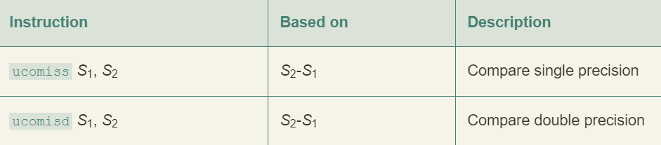

- S1 可以在 XMM 寄存器中也可以在内存中
- S2 必须在 XMM 寄存器中


- 浮点比较指令会设置三个条件码：
	- 零标志位 `ZF`
	- 进位标志位 `CF`
	- 奇偶标志位 `PF`
		- 当两个操作数中人一个是 NaN 时就会设置该位
- 当任意操作数为 NaN，就会出现 `Unordered` 情况

