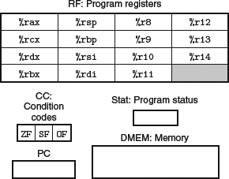
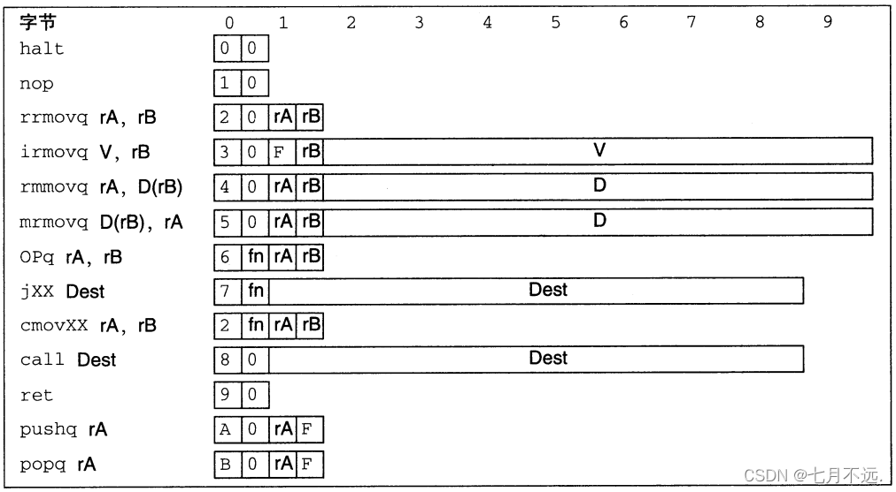
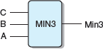
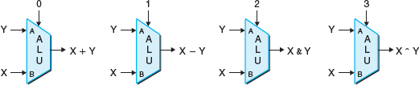
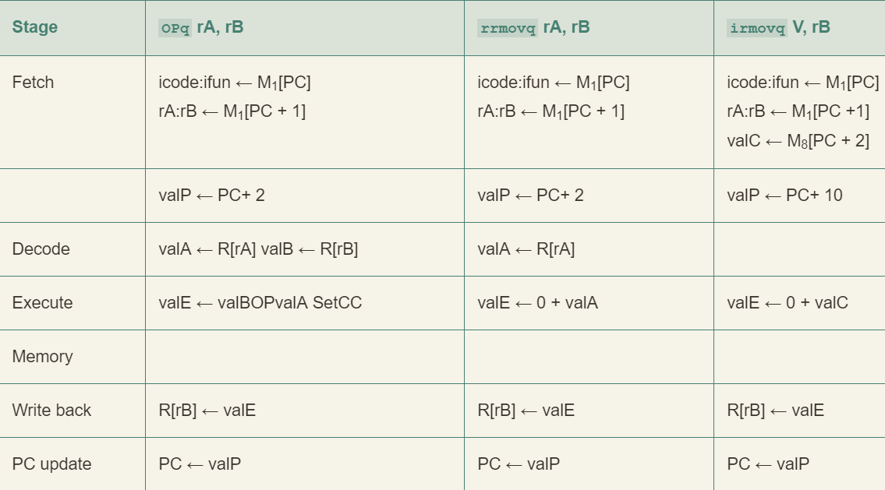

# Y86-64 指令集体系结构

## 程序员可见状态



- 省略了 %r15 以简化指令的编码
- 三个一体的条件码：ZF、SF 和 OF
- Stat：状态码，表明程序执行的总体状态

## Y86-64 指令

Y86-64 指令集基本上是 x86-64 指令集的一个子集，它只包括 8 字节整数操作，寻址方式较少，操作也较少。下面是一些细节：

- 左边是指令的汇编码表示，右边是字节编码
- X 86-64 的 movq 指令分成了 4 个不同的指令：irmovq、rrmovq、mrmovq 和 rmmovq
	- 分别显式地指明源和目的的格式
	- 源可以是立即数（i）、寄存器（r）或内存（m），指令名字第一个字母就表明了源的类型
	- 目的可以是寄存器（r）和内存（m），指令名字第二个字母指明了目的的类型
- 和 x 86-64 一样，不允许从一个内存地址直接传送到另一个内存地址。
	- 另外，也不允许将立即数传送到内存
- 有 4 个整数操作指令，如 OPg，它们是 addq、subq、andq 和 xorq
	- 只会对寄存器数据进行操作，而 x86-64 还允许对内存数据进行这些操作
	- 它们会设置三个条件码
- halt 指令停止指令的执行。x86-64 中有一个与之相当的 hlt
	- x86-64 的应用程序不允许使用这条指令，它会导致整个系统暂停运行
	- 对于 Y86-64 来说，执行 halt 指令会导致处理停止运行，并将状态码设置为 HLT



- 指令编码长度从 1 个字节到 10 个字节不等
- 一条指令含有一个单字节的指令指示符，可能含有一个单字节的寄存器指示符，还可能含有一个 8 字节的常数字
- fn 指明是某个整数操作（OPg）、数据传送条件（cmovXX）或是分支条件（jXX）
- 所有的数值均用十六进制表示

## 指令编码

每条指令需要 1~ 10 个字节不等，每条指令的第一个字节表明指令的类型
- 这个字节分为两个部分
- 高四位是代码部分
- 第四位是功能部分
- 如图 4.2 所示，代码值为 0~0xB


Y86-64 中的寄存器编号和 x86-64 相同，当需要指明不应访问任何寄存器时，就用 ID 值 0xF 来表示 


## Y86-64 异常


# 逻辑设计和硬件控制语言 HCL

## 逻辑门


## HCL



用 HCL 来表达：

```HCL
word Min3 = [
	A <= B && A <= C : A;
	B <= A && B <= C : B;
	1                : C;
];
```

## ALU



## 存储器和时钟


- 寄存器操作
- 寄存器输出会一直保持在当前寄存器状态上，直到时钟信号上升
- 当时钟上升时，寄存器输入上的值会成为新的寄存器状态


- 读端口：A 和 B    写端口：W
- 这样一个多端口随机访问存储器允许同时进行多个读和写操作
- 当 srcA 或 srcB 被设置成某个寄存器 ID 时，在一段延迟之后，寄存器中的值就会出现在 valA 或 valB 上
	- 例如：srcA = 3，就会读出 `%rbx` 的值，然后出现在输出 valA 上
- 每次时钟上升时，输入 valW 上的值会被写入输入 dstW 上的寄存器 ID 指示的程序寄存器
	- 当 dstW 设为特殊 ID 值为 0xF 时，不会写入

# Y86-64 的顺序实现

## 将处理器组织成阶段

1. fetch：从内存读取指令字节，地址为程序计数器 (PC) 的值。有两个四字节部分：icode 和 ifun。它可能取出一个寄存器指示符字节，指明一个或两个寄存器操作数指示符 rA 和 rB。它还可能取出一个 8 字节常数字 valC。也就是说，valP 等于 PC 的值加上已取出指令的长度。
2. decode：从寄存器文件读入最多两个操作数，得到值 valA 和/或 valB。通常它读入指令 rA 和 rB 字段指明的寄存器，不过有些指令是读寄存器 `%rsp` 的。
3. execute：算术逻辑单元要么执行指令指明的操作（根据 ifun 的值），计算内存引用的有效地址，要么增加或减少栈指针。得到的值称为 valE。在此，也可能设置条件码，对一条条件传送指令来说，这个阶段会检查条件码和传送条件（由 ifun 给出），如果条件成立，则更新目标寄存器。同样，对一条跳转指令来说，这个阶段会决定是不是应该选择分支。
4. memory：可以将数据写入内存，或者从内存读出数据。读出的值为 valM
5. Write back：最多可以写两个结果到寄存器文件
6. PC update： 将 PC 设置成下一条指令的地址

处理器无限循环执行这些阶段。发生任何异常时，处理器就会停止：执行 halt 指令或非法指令，或它试图读或写非法地址。在更完整的个设计中，处理器会进入异常处理模式，开始执行由异常的类型决定的特殊代码。



- icode:ifun 表明指令字节的两个组成部分
- rA:rB 表明寄存器指示符字节的两个组成部分
- M1[x] 表示访问(读或写)内存位置 x 处的一个字节，而 M8[x] 表示访问八个字节


