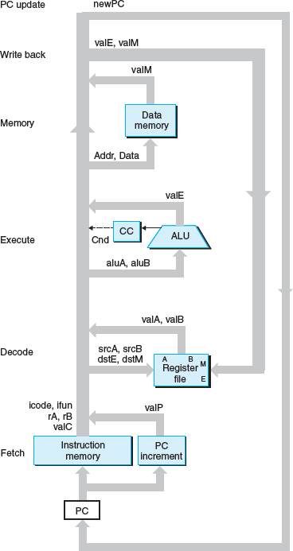
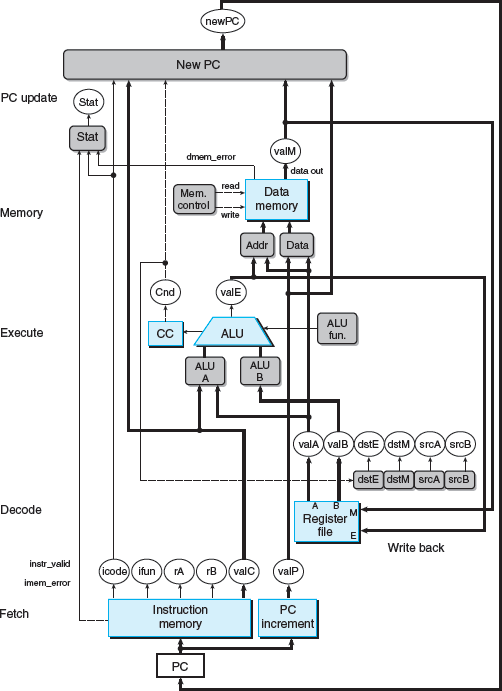
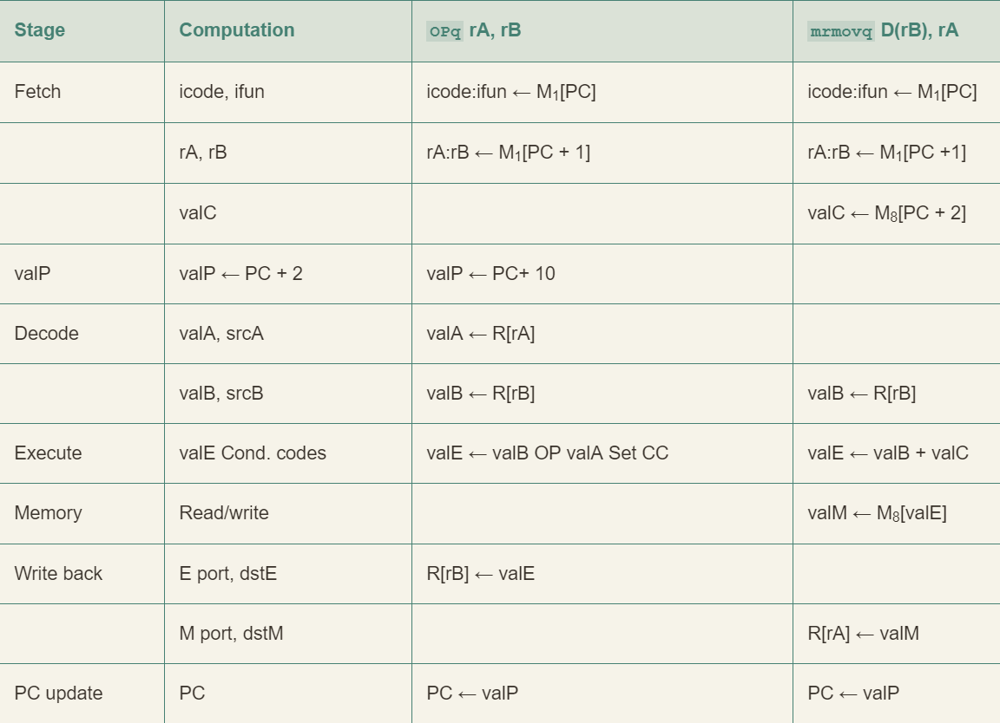
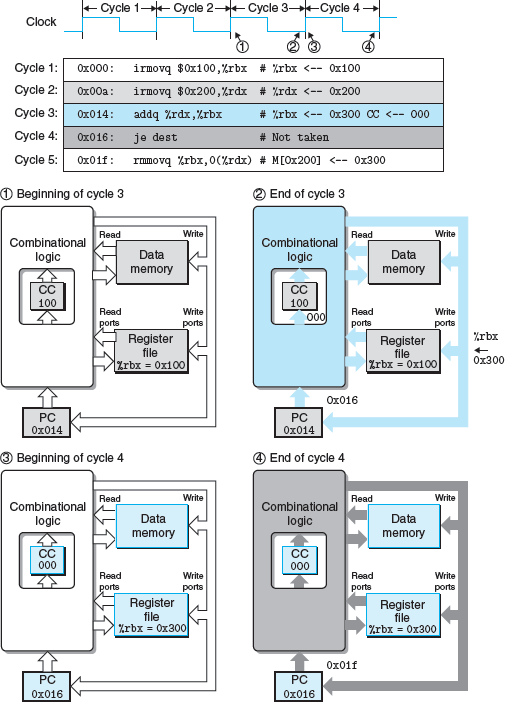

# Y86-64 指令集体系结构

## 程序员可见状态


- 省略了 %r15 以简化指令的编码
- 三个一体的条件码：ZF、SF 和 OF
- Stat：状态码，表明程序执行的总体状态

## Y86-64 指令

Y86-64 指令集基本上是 x86-64 指令集的一个子集，它只包括 8 字节整数操作，寻址方式较少，操作也较少。下面是一些细节：

- 左边是指令的汇编码表示，右边是字节编码
- X 86-64 的 movq 指令分成了 4 个不同的指令：irmovq、rrmovq、mrmovq 和 rmmovq
	- 分别显式地指明源和目的的格式
	- 源可以是立即数（i）、寄存器（r）或内存（m），指令名字第一个字母就表明了源的类型
	- 目的可以是寄存器（r）和内存（m），指令名字第二个字母指明了目的的类型
- 和 x 86-64 一样，不允许从一个内存地址直接传送到另一个内存地址。
	- 另外，也不允许将立即数传送到内存
- 有 4 个整数操作指令，如 OPg，它们是 addq、subq、andq 和 xorq
	- 只会对寄存器数据进行操作，而 x86-64 还允许对内存数据进行这些操作
	- 它们会设置三个条件码
- halt 指令停止指令的执行。x86-64 中有一个与之相当的 hlt
	- x86-64 的应用程序不允许使用这条指令，它会导致整个系统暂停运行
	- 对于 Y86-64 来说，执行 halt 指令会导致处理停止运行，并将状态码设置为 HLT


- 指令编码长度从 1 个字节到 10 个字节不等
- 一条指令含有一个单字节的指令指示符，可能含有一个单字节的寄存器指示符，还可能含有一个 8 字节的常数字
- fn 指明是某个整数操作（OPg）、数据传送条件（cmovXX）或是分支条件（jXX）
- 所有的数值均用十六进制表示

## 指令编码

每条指令需要 1~ 10 个字节不等，每条指令的第一个字节表明指令的类型
- 这个字节分为两个部分
- 高四位是代码部分
- 第四位是功能部分
- 如图 4.2 所示，代码值为 0~0xB


Y86-64 中的寄存器编号和 x86-64 相同，当需要指明不应访问任何寄存器时，就用 ID 值 0xF 来表示 


## Y86-64 异常


# 逻辑设计和硬件控制语言 HCL

## 逻辑门


## HCL


用 HCL 来表达：

```HCL
word Min3 = [
	A <= B && A <= C : A;
	B <= A && B <= C : B;
	1                : C;
];
```

## ALU


## 存储器和时钟


- 寄存器操作
- 寄存器输出会一直保持在当前寄存器状态上，直到时钟信号上升
- 当时钟上升时，寄存器输入上的值会成为新的寄存器状态


- 读端口：A 和 B    写端口：W
- 这样一个多端口随机访问存储器允许同时进行多个读和写操作
- 当 srcA 或 srcB 被设置成某个寄存器 ID 时，在一段延迟之后，寄存器中的值就会出现在 valA 或 valB 上
	- 例如：srcA = 3，就会读出 `%rbx` 的值，然后出现在输出 valA 上
- 每次时钟上升时，输入 valW 上的值会被写入输入 dstW 上的寄存器 ID 指示的程序寄存器
	- 当 dstW 设为特殊 ID 值为 0xF 时，不会写入

# Y86-64 的顺序实现

## 将处理器组织成阶段

1. fetch：从内存读取指令字节，地址为程序计数器 (PC) 的值。有两个四字节部分：icode 和 ifun。它可能取出一个寄存器指示符字节，指明一个或两个寄存器操作数指示符 rA 和 rB。它还可能取出一个 8 字节常数字 valC。也就是说，valP 等于 PC 的值加上已取出指令的长度。
2. decode：从寄存器文件读入最多两个操作数，得到值 valA 和/或 valB。通常它读入指令 rA 和 rB 字段指明的寄存器，不过有些指令是读寄存器 `%rsp` 的。
3. execute：算术逻辑单元要么执行指令指明的操作（根据 ifun 的值），计算内存引用的有效地址，要么增加或减少栈指针。得到的值称为 valE。在此，也可能设置条件码，对一条条件传送指令来说，这个阶段会检查条件码和传送条件（由 ifun 给出），如果条件成立，则更新目标寄存器。同样，对一条跳转指令来说，这个阶段会决定是不是应该选择分支。
4. memory：可以将数据写入内存，或者从内存读出数据。读出的值为 valM
5. Write back：最多可以写两个结果到寄存器文件
6. PC update： 将 PC 设置成下一条指令的地址

处理器无限循环执行这些阶段。发生任何异常时，处理器就会停止：执行 halt 指令或非法指令，或它试图读或写非法地址。在更完整的个设计中，处理器会进入异常处理模式，开始执行由异常的类型决定的特殊代码。


- icode:ifun 表明指令字节的两个组成部分
- rA:rB 表明寄存器指示符字节的两个组成部分
- M1[x] 表示访问(读或写)内存位置 x 处的一个字节，而 M8[x] 表示访问八个字节


## SEQ

SEQ 是能执行 fetch, decode, execute, memory, write back, and PC update 这些计算的硬件结构的抽象表示

### 硬件结构



SEQ 的抽象视图，一种顺序实现



- 白色方框表示时钟寄存器。PC 是 SEQ 中唯一的时钟寄存器
- 浅蓝色方框表示硬件单元。不必关心它们的细节设计
- 线路名字在白色圆圈中说明
- 宽度为字长的数据连接用中等粗度的线表示。每条这样的线实际上都代表一簇 64 根线并列连在一起将数据传送到硬件的另一部分
- 宽度为字节或更窄的数据连接用细线表示。根据线上要携带的值的类型，实际上都代表一簇 4 根或 8 根线
- 单个位的连接用虚线表示。代表芯片上单元与块之间传递的控制值



### 时序

**从不回读**：Y86-64 指令集的原则，处理器从来不需要为了完成一条指令的执行而去读由该指令更新了的状态

SEQ 的实现包括组合逻辑和两种存储设备：
- 组合逻辑不需要任何时序或控制，只要输入变化了，值就通过逻辑门网络传播
- 时钟寄存器：程序计数器和条件码寄存器
- 随机访问存储器：寄存器文件、指令内存和数据内存

有四个单元需要对它们的时序进行明确的控制：程序计数器、条件码寄存器、数据内存和寄存器文件
- 它们都通过一个时钟信号来控制，它触发将新值装载到寄存器以及将值写到随机访问寄存器
- 每个时钟周期，程序计数器都会装载新的指令地址
- 只有执行整数运算指令时，才会写数据内存
- 寄存器文件的两个写端口允许每个时钟周期更新两个程序寄存器，不过我们可以用特殊的寄存器 ID 0xF 作为端口地址，来表明在此端口不应该执行写操作

#### 例子

```assembly
1	0x000:	irmovq $0x100, %rbx	   # %rbx <-- 0x100
2	0x00a:	irmovq $0x200,%rdx	   # %rdx <-- 0x200
3	0x014:	addq %rdx, %rbx	       # %rbx <-- 0x300 CC <-- 000
4	0x016:	je dest	               # Not taken
5	0x0lf:	rmmovq %rbx,0(%rdx)	   # M[0x200] <-- 0x300
6	0x029:	dest: halt
```

 

### SEQ阶段的实现


#### fetch 阶段


根据 icode 值可以计算三个一位的信号：
- instr_valid：这个字节对应于一个合法的 Y86-64 指令吗？这个信号用来发现不合法的指令
- need_regids：这个指令包括一个寄存器指示符字节吗？
- need_valC：这个指令包括一个常数字吗？
- (当指令地址越界时会产生的)信号 instr_valid 和 imem_error 在访存阶段被用来产生状态码

```HCL
bool need_regids =
	icode in { IRRMOVQ, IOPQ, IPUSHQ, IPOPQ, IIRMOVQ, IRMMOVQ, IMRMOVQ };

bool need_valC =
	icode in { IIRMOVQ, IRMMOVQ, IMRMOVQ, IJXX, ICALL };
```

Align 对剩下 9 个字节的处理：
- 当计算出来的信号 need_regids 为 1 时，字节 1 被分开装入寄存器指示符 rA 和 rB 中
	- 否则，这两个字段会被设为 0xF (RNONE) 表明这条指令没有指明寄存器
	- 因此，可以将信号 rA 和 rB 看成，要么放着我们想要访问的寄存器，要么表明不需要访问任何寄存器
- 根据 need_valC 的值，要么根据字节 1~8 来产生 valC ，要么根据字节 2~9 产生
- PC 增加器硬件单元根据当前的 PC 以及以上两个信号的值产生 valP
	- PC 值为 p、need_regids 值 r 以及 need_valC 值 i
	- 增加器产生值  p + 1 + r + 8i

#### Decode 和 Write-Back 阶段


```HCL
word srcA = [
		icode in { IRRMOVQ, IRMMOVQ, IOPQ, IPUSHQ } : rA;
		icode in { IPOPQ, IRET } : RRSP; 
		1 : RNONE; # Don't need register
];

word srcB = [
		icode in { IRMMOVQ, IOPQ, IMRMOVQ } : rB;
		icode in { IPOPQ, IPUSHQ, IRET, ICALL } : RRSP; 
		1 : RNONE; # Don't need register
];
```

```HCL
# WARNING: Conditional move not implemented correctly here word
dstE = [
	icode in { IRRMOVQ } : rB;
	icode in { IIRMOVQ, IOPQ} : rB;
	icode in { IPUSHQ, IPOPQ, ICALL, IRET } : RRSP;
	1 : RNONE; # Don't write any register
];

dstM = [
	icode in { IMRMOVQ, IPOPQ } : rA;
	1 : RNONE; # Don't write any register
];

```

#### Execute 阶段


```HCL
word aluA = [
	icode in { IRRMOVQ, IOPQ } : valA;
	icode in { IIRMOVQ, IRMMOVQ, IMRMOVQ } : valC;
	icode in { ICALL, IPUSHQ } : -8;
	icode in { IRET, IPOPQ } : 8;
	# Other instructions don't need ALU
];

word aluB = [
	icode in { IRMMOVQ, IMRMOVQ, IOPQ, ICALL, IPUSHQ, IRET, IPOPQ } : valB;
	icode in { IRRMOVQ, IIRMOVQ } : 0;
	# Other instructions don't need ALU
];
```

```HCL
word alufun = [
	icode == IOPQ : ifun;
	1 : ALUADD;
];

bool set_cc = icode in { IOPQ };
```

#### Memory 阶段


```HCL
word mem_addr = [
	icode in { IRMMOVQ, IPUSHQ, ICALL, IMRMOVQ } : valE;
	icode in { IPOPQ, IRET } : valA;
	# Other instructions don't need address
];

word mem_data = [
	# Value from register
	icode in { IRMMOVQ, IPUSHQ } : valA;
	# Return PC
	icode == ICALL : valP;
	# Default: Don't write anything
];
```

```
bool mem_write = icode in { IRMMOVQ, IPUSHQ, ICALL };
bool mem_read = icode in { IMRMOVQ, IPOPQ, IRET };
```

```
## Determine instruction status
word Stat = [
	imem_error | | dmem_error : SADR;
	!instr_valid: SINS;
	icode == IHALT : SHLT;
	1 : SAOK;
];
```

#### PC Update 阶段


```
word new_pc = [
	# Call. Use instruction constant 
	icode == ICALL : valC;
	# Taken branch. Use instruction constant 
	icode == IJXX && Cnd : valC;
	# Completion of RET instruction. Use value from stack 
	icode == IRET : valM;
	# Default: Use incremented PC 
	1 : valP;
];
```