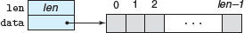
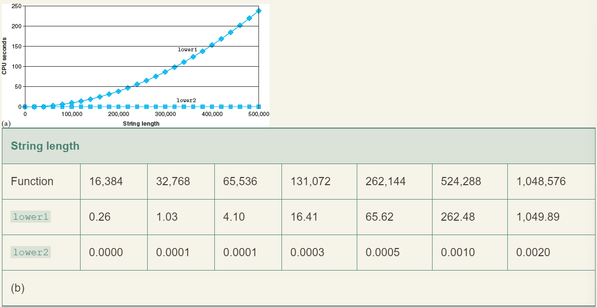
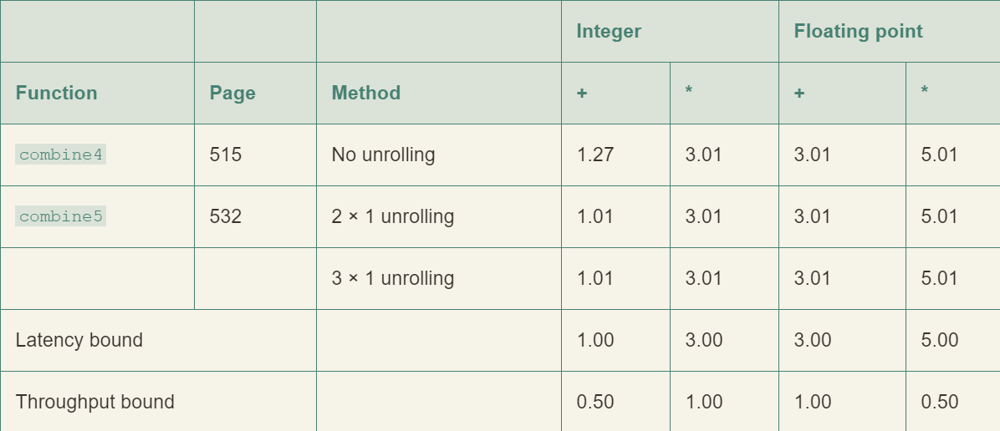
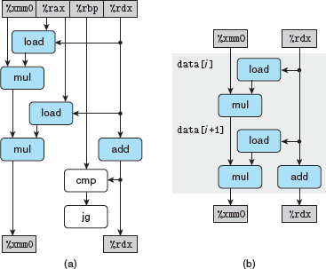
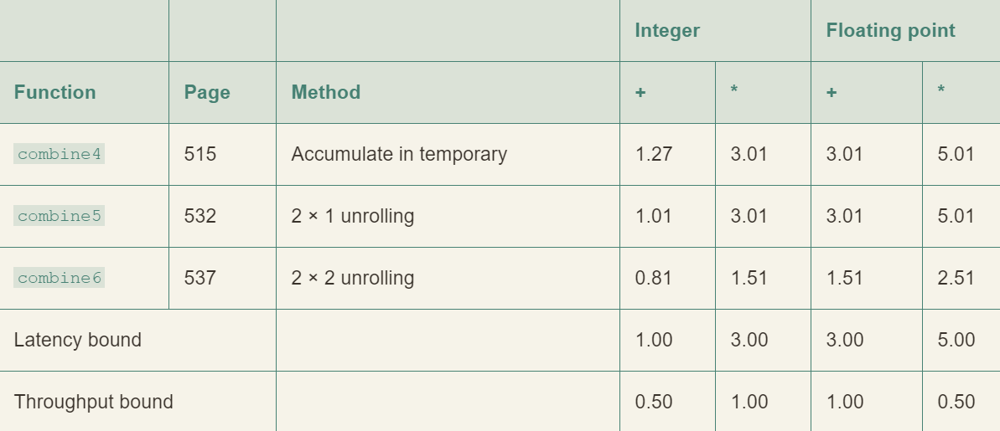
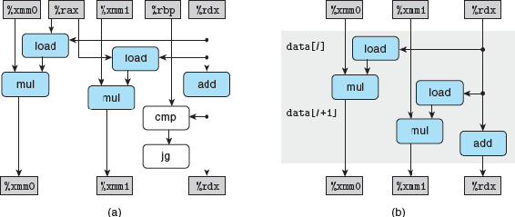
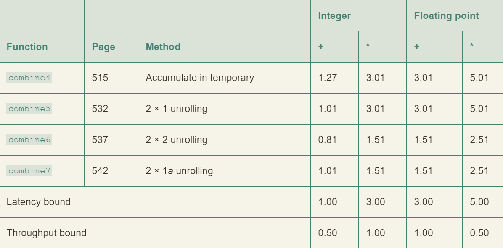
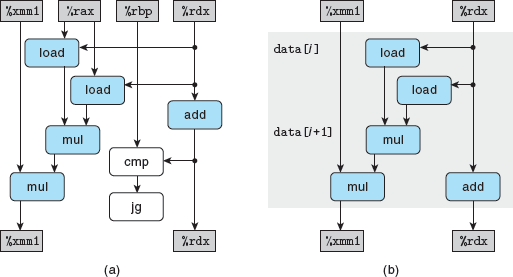

# 优化编译器的能力和局限性

1. 一种有用的策略是只重写程序，使其达到编译器可以生成高效代码的程度。
2. 减少读取指针的次数来优化程序
3. 如果编译器不能确定两个指针是否指向同一个位置，就必须假设什么情况都有可能，这样会限制编译器的优化策略
4. 内联函数替换

# 程序优化实例



```
/* Create abstract data type for vector */
typedef struct {
	long len;
	data_t *data;
} vec_rec, *vec_ptr;
```

向量的抽象数据类型

```
/* Create vector of specified length */
vec_ptr new_vec(long len)
{
	/* Allocate header structure */
	vec_ptr result = (vec_ptr) malloc(sizeof(vec_rec));
	data_t *data = NULL;
	if (!result)
		return NULL; /* Couldn't allocate storage */
	result->len = len;
	/* Allocate array */
	if (len > 0) {
		data = (data_t *)calloc(len, sizeof(data_t));
		if (!data) {
			free((void *) result);
			return NULL; /* Couldn't allocate storage */
		}
	}
	/* Data will either be NULL or allocated array */
	result->data = data;
	return result;
}

/*
* Retrieve vector element and store at dest.
* Return 0 (out of bounds) or 1 (successful)
*/
int get_vec_element(vec_ptr v, long index, data_t *dest)
{
	if (index < 0 | | index >= v->len)
		return 0;
	*dest = v->data [index];
	return 1 ;
}

/* Return length of vector */
long vec_length(vec_ptr v)
{
	return v->len;
}
```

向量抽象数据类型的实现

```
/* Implementation with maximum use of data abstraction */
void combinel(vec_ptr v, data_t *dest)
{
	long i;

	*dest = IDENT;
	for (i = 0; i < vec_length(v); i++) {
		data_t val;
		get_vec_element(v, i, &val);
		*dest = *dest OP val;
	}
}
```

合并运算的初始实现

求和声明：

```
#define IDENT 0
#define OP +
```

乘积声明：

```
#define IDENT 1
#define OP *
```

## 消除循环的低效率

```
/* Move call to vec_length out of loop */
void combine2(vec_ptr v, data_t *dest)
{
	long i;
	long length = vec_length(v);

	*dest = IDENT;
	for (i = 0; i < length; i++) {
		data_t val;
		get_vec_element(v, i, &val);
		*dest = *dest OP val;
	}
}
```

多次调用 vec_length 方法来获取长度实现循环会降低效率

## 低效率极端例子

识别要执行多次，但是计算结果不会改变的计算，可以将计算移动到代码前面不会被多次求值的部分

```
/* Convert string to lowercase: slow */
void lower1(char *s)
{
	long i;

	for (i = 0; i < strlen(s); i++)
		if (s[i] >= `A' && s[i] <= `Z')
			s[i] -= (`A' - `a');
}

/* Convert string to lowercase: faster */
void lower2(char *s)
{
	long i;
	long len = strlen(s);

	for (i = 0; i < len; i++)
		if (s[i] >= `A' && s[i] <= `Z')
			s[i] -= (`A' - `a');
}

/* Sample implementation of library function strlen */
/* Compute length of string */
size_t strlen(const char *s)
{
	long length = 0;
	while (*s != `\0') {
			s++;
			length++;
	}
	return length;
}
```



## 减少过程调用

- combine 2 的代码每次循环都会调用 get_vec_element 来获取下一个向量元素。
- 对每个向量引用，这个函数都要把向量索引 i 与循环边界作比较，这会造成低效率

```
data_t *get_vec_start(vec_ptr v)
{
	return v->data;
}
```

```
/* Direct access to vector data */
void combine3(vec_ptr v, data_t *dest)
{
	long i;
	long length = vec_length(v);
	data_t *data = get_vec_start(v); 

	*dest = IDENT;
	for (i = 0; i < length; i++) {
		*dest = *dest OP data[i];
	}
}
```

这并没有立刻得到明显的提升，显然还有其他瓶颈

## 消除不必要的内存引用

分析 combine3 循环代码生成的汇编代码：

```
Inner loop of combine3. data_t = double, OP = *
dest in %rbx, data+i in %rdx, data+length in %rax
. L17:				              loop:
   vmovsd (%rbx), %xmm0		        Read product from dest
   vmulsd (%rdx), %xmm0, %xmm0	    Multiply product by data[i]
   vmovsd %xmm0, (%rbx)		        Store product at dest
   addq $8, %rdx		            Increment data+i
   cmpq %rax, %rdx		            Compare to data+length
   jne .L17			                If !=, goto loop
```

- 它将代码改变为：在寄存器 %rdx 中维护一个指向第 i 个数据元素的指针，在注释中显示为 data+i。
- 该指针在每次迭代中增加8。通过将该指针与存储在寄存器 %rax 中的指针进行比较来检测循环终止。
- 每次迭代都会从内存中读取和写入累积的值。这种读写是浪费的，因为每次迭代开始时从 dest 读取的值应该只是前一次迭代结束时写入的值。


```
Inner loop of combine4. data_t = double, OP = *
acc in %xmm0, data+i in %rdx, data+length in %rax
.L25:				loop:
  vmulsd (%rdx), %xmm0, %xmm0	  Multiply acc by data[i]
  addq $8, %rdx			  Increment data+i
  cmpq %rax, %rdx		  Compare to data+length
  jne .L25			  If !=, goto loop
```

```
1	/* Accumulate result in local variable */
2	void combine4(vec_ptr v, data_t *dest)
3	{
4		long i;
5		long length = vec_length(v);
6		data_t *data = get_vec_start(v);
7		data_t acc = IDENT;
8	
9		for (i = 0; i < length; i++) {
10			acc = acc OP data[i];
11		}
12		*dest = acc;
13	}
```

- 我们引入了一个临时变量 acc，用于在循环中累积计算出的值，只有在循环完成后，结果才存储在 dest 中。
- 如上面的汇编代码所示，编译器现在可以使用寄存器%xmm0来保存累积值。
- 与 combine3中的循环相比，我们将每次迭代的内存操作从两次读一次写减少到只需要一次读。

## 循环展开

```
/* 2 x 1 loop unrolling */
void combine5(vec_ptr v, data_t *dest)
{
	long i;
	long length = vec_length(v);
	long limit = length-1;
	data_t *data = get_vec_start(v);
	data_t acc = IDENT; 9
	/* Combine 2 elements at a time */
	for (i = 0; i < limit; i+=2) {
		acc = (acc OP data[i]) OP data[i+1];
	}

	/* Finish any remaining elements */
	for (;i < length; i++) {
		acc = acc OP data[i];
	}
	*dest = acc;
}
```

- 确保第一次循环不会超出数组的界限

```
	Inner loop of combine5. data_t = double, OP = *
	i in %rdx, data %rax, limit in %rbx, acc in %xmm0
1	.L35:					                  loop:
2	  vmulsd (%rax,%rdx,8), %xmm0, %xmm0	    Multiply acc by data[i]
3	  vmulsd 8(%rax,%rdx,8), %xmm0, %xmm0	    Multiply acc by data[i+1]
4	  addq $2, %rdx				                Increment i by 2
5	  cmpq %rdx, %rbp			                Compare to limit:i
6	  jg .L35				                    If >, goto loop
```



- 整数加法的一个周期的延迟称为限制性能的因素



## 提高并行性

```
/* 2 x 2 loop unrolling */
void combine6(vec_ptr v, data_t *dest)
{
	long i;
	long length = vec_length(v);
	long limit = length-1;
	data_t *data = get_vec_start(v);
	data_t acc0 = IDENT;
	data_t acc1 = IDENT;

	/* Combine 2 elements at a time */
	for (i = 0; i < limit; i+=2) {
		acc0 = acc0 OP data[i];
		acc1 = acc1 OP data[i+1];
	}

	/* Finish any remaining elements */
	for (;i < length; i++) {
		acc0 = acc0 OP data[i];
	}
	*dest = acc0 OP acc1;
}
```

- 2 x 2 循环展开
- 打破了由延迟界限设下的限制。处理器不再需要延迟一个加法或乘法操作以待前一个操作完成





## 重新结合变换

```
/* 2 x 1a loop unrolling */
void combine7(vec_ptr v, data_t *dest)
{
	long i;
	long length = vec_length(v);
	long limit = length-1;
	data_t *data = get_vec_start(v);
	data_t acc = IDENT; 9
	/* Combine 2 elements at a time */
	for (i = 0; i < limit; i+=2) {
		acc = acc OP (data[i] OP data[i+1]);
	} 

	/* Finish any remaining elements */
	for (;i < length; i++) {
		acc = acc OP data[i];
	}
	*dest = acc;
}
```

- 与 combine 5 不同的之处于第 11 行
- 性能提升很大，几乎与 combine6 相同
- 修改之后，每次迭代内的第一个乘法都不需要等待前一次迭代的累计值就可以执行



