# 高速缓存存储器

## 直接映射高速缓存


1. 组选择
   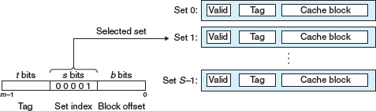
2. 行匹配
3. 字抽取
   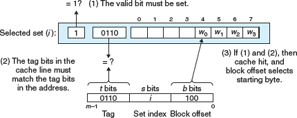

## 综合 (举例)

假设我们有一个直接映射高速缓存，描述如下：

（S，E，B，m） = （4,1,2,4）

高速缓存有四个组，每个组一行，每个块两个字节，地址是四位


- 标记位和索引位连起来唯一的标识了内存中的每个块。
	- 例如：块 0 是由地址 0 和 1 组成的，块 1 是由地址 2 和 3 组成的，块 2 是由地址 4 和 5 组成的，以此类推。
- 由八个内存块，但只有四个高速缓存组，所以多个块会映射到同一个高速缓存组（即它们有相同的组索引）
	- 例如：块 0 和 4 都映射到组 0，块 1 和 5 都映射到组 1
- 映射到同一个高速缓存组的块由标记位唯一地标识。
	- 例如：块 0 的标记位为 0，而块 4 的标记位为 1，块 1 的标记位为 0，而块 5 的标记位为 1，以此类推

### 初始时的高速缓存 （空的）：

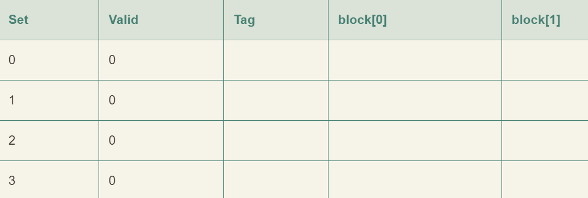

### 读地址 0 的字

1. 组 0 的有效位是 0，缓存不命中
2. 高速缓存从内存去除块 0，并把这个块存储在组 0 中（或从第一位的高速缓存取出）
3. 高速缓存返回新取出的高速缓存行的块[0] 的 m[0]（内存位置 0 的内容）

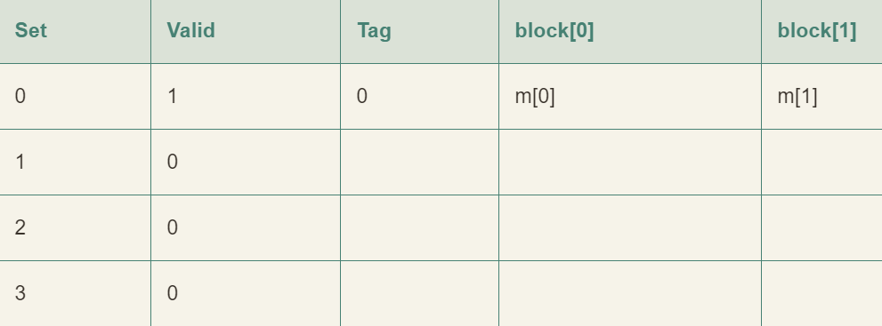

### 读地址 1 的字

缓存命中，立即返回，高速缓存的状态没有变化

### 读地址 13 的字

1. 组 2 中的高速缓存行不是有效的，缓存不命中
2. 把块 6 加载到组 2 中
3. 然后返回新的高速缓存行块[1] 的 m[13]

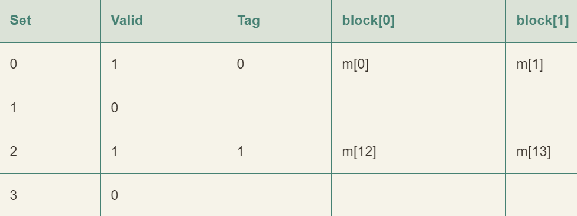

### 读地址 8 的字

1. 缓存不命中
2. 高速缓存将块 4 加载到组 0 中
3. 返回新的高速缓存行块[0] 的 m[8]

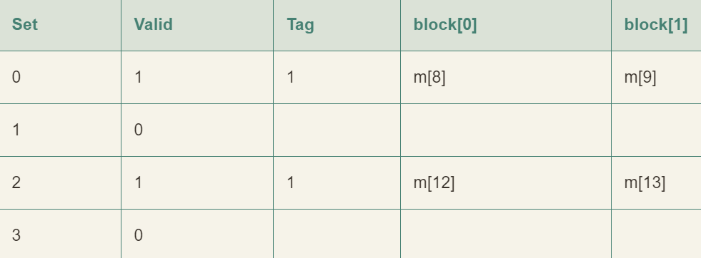

### 读地址 0 的字

1. 组 0 的有效位是 0，缓存再次不命中
2. w 我们拥有足够的高速缓存空间，但却交替的引用映射到同一个组的块

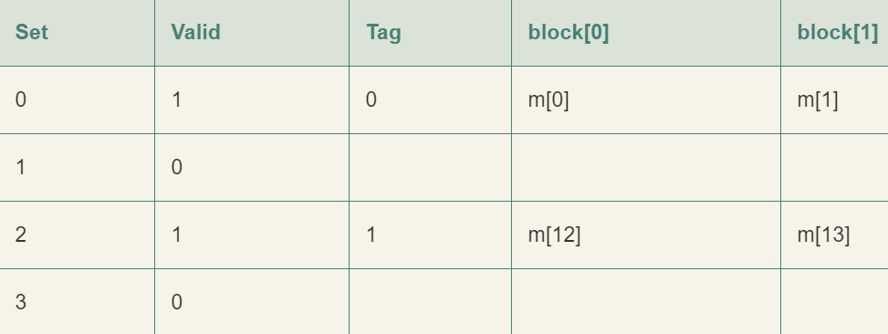

## 解决方法

上述的情况被称为 **抖动**

当程序范围大小为 2 的幂的数组时，直接映射高速缓存中通常会发生冲突不命中

例如：

```
float dotprod(float x [8], float y [8])
{
	float sum = 0.0;
	int i;

	for (i = 0; i < 8; i++)
		sum += x [i] * y [i];
	return sum;
}
```

它拥有良好的空间局部性，因此我们期望它的命中率会比较高，实际上，并非如此

- 假设浮点数是 4 个字节，x 被加载到从地址 0 开始的 32 字节连续内存中，y 紧跟在 x 之后，从地址 32 开始
- 假设一个块是 16 个字节，足够容纳四个浮点数，高速缓存由两个组构成，高速缓存的整个大小为 32 字节
- 假设变量 sum 实际上存放在一个 CPU 寄存器中，因此不需要内存引用
- 根据以上假设每个 x[i] 和 y[i] 会映射到相同的高速缓存组

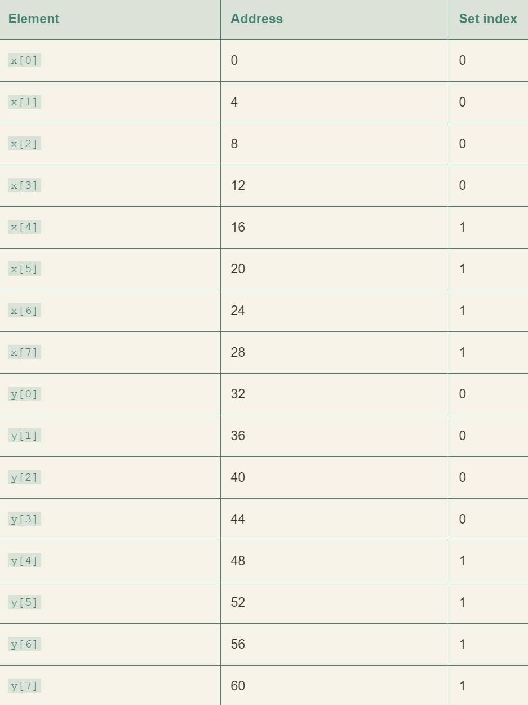

运行时：
- 循环的第一次迭代引用 x[0]，缓存不命中会导致包含 x[0] ~ x[3] 的块被加载到组 0
- 下一次是对 y[0] 的引用，又一次缓存不命中会导致包含 y[0] ~ y[3] 的块被加载到组 0
- 这将会覆盖前一次引用复制进来的 x 的值
- 在下一次迭代中，对 x[1] 的引用不命中，导致包含 x[0] ~ x[3] 的块被加载到组 0
- 这将会覆盖前一次引用复制进来的 y 的值

以上情况也被称为抖动，即使有良好的空间局部性和高速缓存的足够空间，每次引用还是会导致冲突不命中，这是因为这些块被映射到了同一个高速缓存组。

修正：
- 在每个数组的结尾放 B 字节的填充
- 将 x 定义为 float x[12]
- 假设在内存中 y 紧跟在 x 后面，于是出现了以下映射

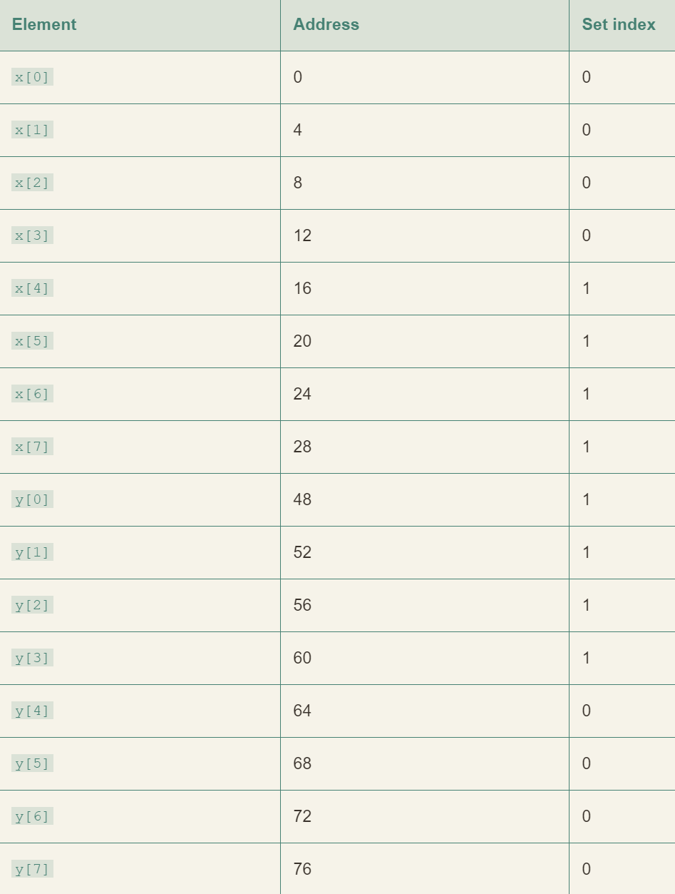

在 x 结尾加了填充，x[i] 和 y[i] 现在就映射到了不同的组，消除了抖动冲突不命中

# 编写高速缓存友好的代码

## 让最常见的情况运行的快

程序大部分运行时间都花在少量核心函数上，而这些函数把大部分时间花在少量循环上。所以要把注意力集中在核心函数的循环上，而忽略其他部分

## 尽量减少每个循环内部的缓存不命中数量

在其他条件都相同的情况下，不命中率较低的循环运行的更快，例如加载和存储的总次数

- 对局部变量的重复引用是好的，因为编译器能够将它们缓存在寄存器文件中（时间局部性）
- 步长为 1 的引用模式是好的，因为存储器层次结构中所有层次上的缓存都是将数据数据存储为连续的块（空间局部性）
- 在对多维数组进行操作的程序中，空间局部性尤为重要

# 高速缓存对程序性能的影响

## 存储器山


图 6-41

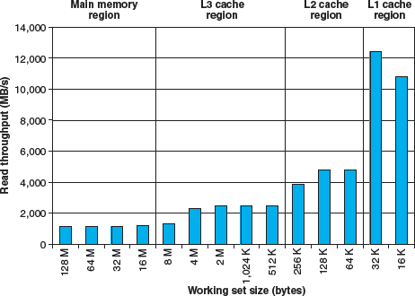

- stride=8 时的一个片段（图 6-41 的山脊）

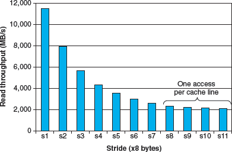

- 一个空间局部性的斜坡。图 6-41 大小=4mb 的片段

**我们要利用时间局部性，使得频繁使用的字从 L1 中取出，还要利用空间局部性，使尽可能多的字从一个 L1高速缓存行中访问到。**

## 在程序中利用局部性

- 将注意力集中在内循环上，大部分计算和内存访问都发生在这里
- 通过按照数据对象存储在内存中的顺序、以步长为 1 的来读数据，从而使得你程序中的空间局部性最大
- 一旦从存储器中读入了一个数据对象，就尽可能多使用，从而是的程序中的时间局部性最大