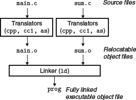

```c
int sum(int *a, int n);

int array[2] = {1, 2};

int main()
{
	int val = sum(array, 2);
	return val;
}
```

`main.c`

```c
int sum(int *a, int n)
{
	int i, s = 0;

	for (i = 0; i < n; i++) {
		s += a[i];
	}
	return s;
}
```

`sum.c`

# 编译器驱动程序



- 静态链接。链接器将可重定位目标文件组合起来，形成一个可执行目标文件 prog
- `linux> gcc -Og -o prog main.c sum.c`
	1. 驱动程序首先运行 C 预处理器 (cpp)，它将 C 的源程序 `mian.c` 翻译成一个 ASCII 码的中间文件 `main.i` : `cpp [other arguments] main.c /tmp/main.i`
	2. 驱动程序运行 C 编译器 (cc 1)，它将 `main.i` 翻译成一个 ASCII 编译语言文件 `main.s` : `cc1 /tmp/main.i -0g [other arguments] -o /tmp/main.s`
	3. 驱动程序运行汇编器 (as)，它将 `main.s` 翻译成一个可重定位目标文件 `main.o` : `as [other arguments] -o /tmp/main.o /tmp/main.s`
	4. 驱动程序结果相同的过程生成 `sum.o` ，最后，它运行链接器程序 `ld`，将 `main.o` 和 `sum.o` 以及一些必要的系统目标文件组合起来，创建一个可执行目标文件 `prog` : `ld -o prog [system object files and args] /tmp/main.o /tmp/sum.o`
	5. 最后，执行：`linux> ./prog`，shell 调用操作系统中一个叫做加载器 (loader) 的函数，它将可执行文件 `prog` 中的代码和数据复制到内存，然后控制转移到这个程序的开头