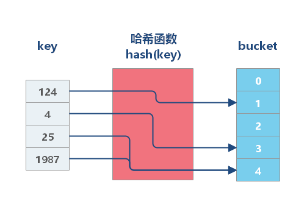
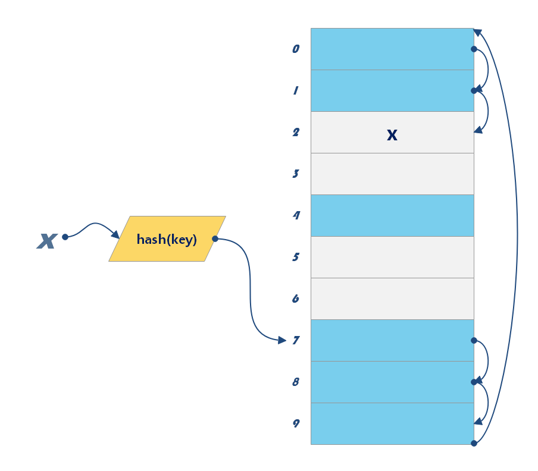
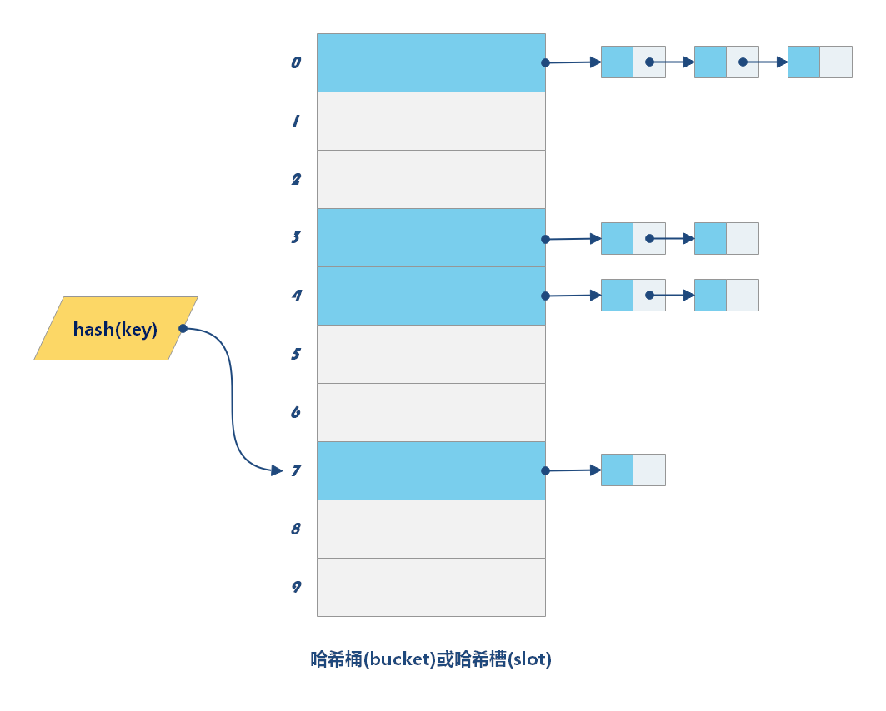

# 哈希表

1. 哈希表 是一种使用 哈希函数 组织数据，以支持快速插入和搜索的数据结构。
2. 哈希表通过哈希函数把元素的键值映射为下标，然后将数据存储在数组中对应下标的位置。按照键值查询元素时，用同样的散列函数，将键值转化数组下标，从对应的数组下标的位置取数据。
3. 有两种不同类型的哈希表：哈希集合 和 哈希映射：
   - 哈希集合 是集合数据结构的实现之一，用于存储非重复值。 
   - 哈希映射 是映射 数据结构的实现之一，用于存储 (key, value) 键值对。

## 散列函数( hash(key) )

1. 当我们插入一个新的键时，哈希函数将决定该键应该分配到哪个桶中，并将该键存储在相应的桶中；
2. 当我们想要搜索一个键时，哈希表将使用相同的哈希函数来查找对应的桶，并只在特定的桶中进行搜索。

**散列函数设计的基本要求：**

1. 散列函数计算得到的散列值是一个非负整数；
2. 如果 key1 = key2，那 hash (key1) == hash (key2)；
3. 如果 key1 ≠ key2，那 hash (key1) ≠ hash (key2)。

## 散列冲突

无法避免，常用的散列冲突解决方法有两类，开放寻址法（open addressing）和链表法（chaining）。

### 装载因子

为了尽可能保证哈希表的操作效率，一般情况下，我们会尽可能保证哈希表中有一定比例的空闲槽位。我们用装载因子（load factor）来表示空位的多少。

`哈希表的装载因子 = 填入表中的元素个数 / 哈希表的长度`

装载因子越大，说明空闲位置越少，冲突越多，哈希表的性能会下降。

#### 扩容

当装载因子过大时，就需要对哈希表扩容。
- 新申请一个更大的哈希表，将数据搬移到这个新哈希表中。
- 针对数组的扩容，数据搬移操作比较简单。
- 针对哈希表的扩容，数据搬移操作要复杂很多。
  - 哈希表的大小变了，数据的存储位置也变了。
  - 需要通过散列函数重新计算每个数据的存储位置。

**装载因子阈值需要选择得当。如果太大，会导致冲突过多；如果太小，会导致内存浪费严重。**

### 开放寻址法

- 如果出现了散列冲突，我们就重新探测一个空闲位置，将其插入。
- 当数据量比较小、装载因子小的时候，适合采用开放寻址法。
- 这也是Java中的 `ThreadLocalMap` 使用开放寻址法解决散列冲突的原因。

#### 线性探测（Linear Probing）：

当我们往哈希表中插入数据时，如果某个数据经过散列函数散列之后，存储位置已经被占用了，我们就从当前位置开始，依次往后查找，看是否有空闲位置，直到找到为止。

##### 删除问题

对于使用线性探测法解决冲突的哈希表，删除操作稍微有些特别。我们不能单纯地把要删除的元素设置为空。这是为什么呢？在查找的时候，一旦我们通过线性探测方法，找到一个空闲位置，我们就可以认定哈希表中不存在这个数据。但是，如果这个空闲位置是我们后来删除的，就会导致原来的查找算法失效。本来存在的数据，会被认定为不存在。这个问题如何解决呢？

我们可以将删除的元素，特殊标记为 deleted。当线性探测查找的时候，遇到标记为 deleted 的空间，并不是停下来，而是继续往下探测。

### 链表法（chaining）

- 在哈希表中，每个 “桶（bucket）” 或者 “槽（slot）” 会对应一条链表，所有散列值相同的元素我们都放到相同槽位对应的链表中。
- 基于链表的散列冲突处理方法比较适合存储大对象、大数据量的哈希表。
- 比起开放寻址法，它更加灵活，支持更多的优化策略，比如用红黑树代替链表。

### 对比

- 开放寻址法适用于数据量比较小、装载因子小的场景。
- 链表法适用于存储大对象、大数据量的哈希表。

sort from [腾讯开发者社区](https://cloud.tencent.com/developer/article/2259933)